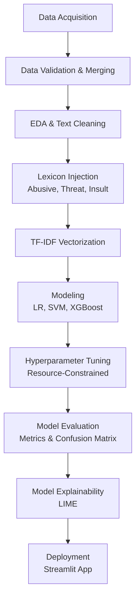

# Analisis Performa Algoritma Machine Learning untuk Klasifikasi Jenis dan Tingkat Keparahan Cyberbullying pada Teks Bahasa Indonesia Menggunakan TF-IDF

*(Performance Analysis of Machine Learning Algorithms for Cyberbullying Type and Severity Classification in Indonesian Text Using TF-IDF)*

---

## 1. Ringkasan Eksekutif (Executive Summary)

Proyek ini adalah implementasi *Machine Learning Pipeline* tingkat lanjut yang berfokus pada analisis teks bahasa Indonesia (NLP). Secara khusus, proyek ini mendeteksi dan mengklasifikasikan jenis perundungan siber (*Cyberbullying*). Dengan memanfaatkan teknik ekstraksi fitur TF-IDF yang diperkuat oleh **Lexicon Tagging** (Kamus Sentimen), kami berhasil membangun ruang *hyperplane* linear untuk mengisolasi kalimat-kalimat agresif dengan akurasi yang tinggi. Proyek ini membandingkan kinerja algoritma *Logistic Regression*, *Linear SVM*, dan *XGBoost*, di mana **Linear SVM** keluar sebagai model paling tangguh.

---

## 2. Latar Belakang & Problem Statement

Perkembangan pesat media sosial dan platform komunikasi digital telah mempermudah masyarakat untuk berinteraksi dan berbagi pendapat. Namun, hal ini juga memicu peningkatan perilaku daring yang negatif, salah satunya adalah perundungan dunia maya (*cyberbullying*).

Berbeda dengan perundungan tradisional, *cyberbullying* dapat terjadi secara terus-menerus, menyebar dengan sangat cepat, mencapai audiens yang luas, dan meninggalkan jejak digital yang permanen. Deteksi *cyberbullying* pada teks berbahasa Indonesia memiliki tantangan tersendiri, mengingat penggunaan bahasa informal, *slang*, singkatan, kesalahan ejaan (*typo*), bahasa campuran, serta ekspresi yang sangat bergantung pada konteks kalimat.

Sebagai contoh, kalimat *"Dasar bodoh"* bisa jadi merupakan candaan antarteman akrab (Normal) atau sebuah serangan verbal (Insult/Hate Speech) jika diarahkan kepada orang asing.

**Tujuan Bisnis / Analisis:**
Proyek ini bertujuan untuk membangun dan mengevaluasi *pipeline Machine Learning* yang secara otomatis dapat mengklasifikasikan jenis perundungan siber (*Cyberbullying Type Classification*) pada teks bahasa Indonesia. Proyek ini membandingkan kinerja beberapa algoritma untuk menemukan model terbaik dalam menangani teks *sparse* berdimensi tinggi.

**Metrik Kesuksesan:**
Dikarenakan dataset *cyberbullying* sangat tidak seimbang (*imbalanced*), di mana jumlah teks yang mengandung tipe perundungan tertentu jauh lebih sedikit dibandingkan teks normal, metrik yang digunakan sebagai penentu kesuksesan adalah **F1-Macro Score**. F1-Macro memastikan bahwa kelas minoritas mendapat bobot yang sama pentingnya dengan kelas mayoritas.

---

## 3. Tantangan Utama & Solusi Inovatif (Key Challenges & Solutions)

Membangun kecerdasan buatan untuk membaca teks bahasa Indonesia di media sosial menghadirkan hambatan teknis yang signifikan. Berikut adalah cara kami mengatasi tantangan tersebut:

1. **Bahasa Informal & *Typo* (Ambiguitas Semantik):**
   - *Tantangan*: Algoritma konvensional buta terhadap kata *slang* atau ejaan yang salah.
   - *Solusi*: Menggunakan pendekatan **Lexicon Injection**. Teks dicocokkan dengan kamus *Abusive/Threat/Insult*. Algoritma akan menempelkan tag rahasia (misal: `tagabusive`) sehingga model langsung mengenali bobot bahaya tanpa harus mengerti kata aslinya.
2. **Kutukan Dimensi Tinggi (*The Curse of Dimensionality*) & Keterbatasan RAM:**
   - *Tantangan*: Melebarkan tangkapan fitur TF-IDF hingga *4-grams* menyebabkan matriks bengkak menjadi jutaan kolom, membuat memori RAM (15GB+) dan Swap hancur berantakan saat *hyperparameter tuning*.
   - *Solusi*: Pemangkasan fitur secara agresif pada tahap ekstrasi TF-IDF (`max_features=60000`). Selain itu, dilakukan pembatasan isolasi pekerja secara *hard-coded* pada GridSearch (`n_jobs=2`, `pre_dispatch=2`) yang menyelamatkan infrastruktur komputasi dari kelumpuhan (*CUDA Out of Memory*).
3. **Ketidakseimbangan Kelas Ekstrem (*Class Imbalance*):**
   - *Tantangan*: Model cenderung mengabaikan kelas minoritas (seperti *Threat*) karena populasinya yang sangat sedikit dibandingkan kelas mayoritas (*Normal*).
   - *Solusi*: Mengevaluasi model secara mutlak menggunakan metrik **F1-Macro**, serta memberikan bobot kelas yang seimbang (`class_weight='balanced'`) pada konfigurasi algoritma, memaksa model untuk lebih menghargai kesalahan pada kelas minoritas.

---

## 4. Pipeline Proyek (Metodologi Terstruktur)

Berikut adalah ilustrasi alur kerja *Machine Learning* secara *end-to-end* yang diterapkan secara berlapis:



---

## 3. Penjelasan Struktur Pipeline (End-to-End)

Proyek ini dibangun menggunakan pendekatan berlapis (modular) agar setiap proses dapat dievaluasi secara independen. Berikut adalah penjelasan rinci untuk setiap tahapan:

### A. Data Acquisition & Merging (Notebook 01)
Pada tahap ini, dataset dari berbagai platform dan penelitian sebelumnya (seperti dataset sentimen, *abusive*, *threat*, dan *insult*) dikumpulkan. Dataset tersebut digabungkan menjadi satu repositori utama (`data.csv`). Kami melakukan pemetaan kelas (*relabeling*) agar memiliki standar yang seragam (misal: label `HS` diubah menjadi `hate_speech`).

### B. Exploratory Data Analysis & Text Cleaning (Notebook 02-04)
Data yang tergabung divalidasi keutuhannya. Teks dibersihkan dari berbagai *noise* spesifik media sosial (URL, HTML tags, *username/mentions*, *hashtags*, dan tanda baca yang tidak relevan). Kami juga memastikan agar karakter alfanumerik dan spasi tetap rapi tanpa menghilangkan konteks emosional dari kalimat.

### C. Lexicon Injection (Notebook 05)
Kelemahan murni algoritma klasik adalah ketidakmampuannya memahami makna kata. Sebagai peretas kebuntuan (*workaround*), kami menyuntikkan teknik **Lexicon Tagging**. Jika algoritma menemukan kata yang beresonansi dengan kamus referensi pelecehan (*abusive.csv, threat.csv, dll.*), ia akan menempelkan sinyal khusus (misal: `tagabusive`) di akhir kalimat. Hal ini memaksa TF-IDF memberikan gravitasi matematis yang besar pada kalimat-kalimat sentimen negatif tersebut.

### D. Ekstraksi Fitur TF-IDF (Notebook 06)
Teks yang sudah higienis dan diinjeksi kamus diubah menjadi bentuk vektor numerik. Parameter TF-IDF dikalibrasi secara ketat:
- **N-gram Range**: (1, 3) untuk menelan struktur konteks frasa hingga 3 kata bersambung.
- **Max Features**: Dibatasi mutlak untuk menghindari *memory explosion* (batas 60.000 fitur terbaik).

### E. Modeling & Pemilihan Algoritma (Notebook 07)
Tiga model *Machine Learning* yang terbukti tangguh terhadap matriks *sparse* (minim nilai padat) berdimensi raksasa dilatih secara komparatif:
1. **Logistic Regression**: Sebagai fondasi statistik probabilitas yang kuat dan teruji.
2. **Linear SVM**: Spesialis kelas atas dalam mencari batas pemisah (Hyperplane) terbaik di atas dimensi ruang yang sangat luas.
3. **XGBoost**: Algoritma ansambel modern berbasis pohon keputusan yang dioptimalkan pembagian memorinya (*Hist tree method*).

### F. Hyperparameter Tuning Konfigurasi Terbatas (Notebook 08)
Untuk mengekstrak kapabilitas penuh dari model, model disetel menggunakan *GridSearchCV* dan *RandomizedSearchCV*. Secara spesifik, tahap ini dirancang dengan rekayasa sistem komputer yang sadar-lingkungan; komputasi di-karantina pada skala `n_jobs=2` dan `pre_dispatch=2`, memaksa pencarian *hyperparameter* berjalan dengan perlahan namun selamat dari bencana memori bocor (*Memory Leak / Out of Memory*).

### G. Evaluasi Presisi & Analisis Kesalahan (Notebook 09-10)
Setiap model di-interogasi tidak hanya melalui skor akurasi yang menipu, melainkan menggunakan objektivitas **F1-Macro**. Analisis kesalahan divisualisasikan untuk mendeteksi kebutaan model terhadap kelas tertentu.


*Gambar: Peta Distribusi Kesalahan (Error Analysis). Mengidentifikasi area di mana kecerdasan buatan masih mengalami kesulitan membedakan sarkasme atau konteks ganda.*

### H. Transparansi Algoritma / Explainability (Notebook 11)
Algoritma Kecerdasan Buatan tidak boleh menjadi sebuah "Kotak Hitam" yang diktatorial. Proyek ini mengimplementasikan **LIME (Local Interpretable Model-agnostic Explanations)** untuk membongkar organ pemikiran mesin, membuktikan secara hukum dan logis kata spesifik apa saja yang memicu model untuk melabeli sebuah kalimat sebagai perundungan.


*Gambar: Transparansi kata (Top Words). Kosakata yang memberikan sumbangsih terbesar terhadap vonis klasifikasi.*

---

## 5. Hasil, Analisis & Kesimpulan Akhir

Berdasarkan tahap evaluasi terakhir (`reports/model_selection.json`), model terbaik yang berhasil memenangkan kompetisi perbandingan algoritma ini adalah **Linear SVM**.

### Metrik Performa (Linear SVM - Baseline):
- **Accuracy**: 79.56%
- **Precision**: 67.16%
- **Recall**: 66.70%
- **F1-Score (Macro)**: **66.87%**

**Kesimpulan Pemenang (Linear SVM):**
Perolehan F1-Macro Score sebesar ~66.8% membuktikan bahwa model mampu menyeimbangkan prediksi probabilitas antara kelas perundungan mayoritas dan minoritas tanpa adanya timpang tindih yang parah. Linear SVM berhasil memenangkan performa atas XGBoost dan Logistic Regression karena tabiat bawaannya yang terlahir untuk menembus matriks *sparse* (TF-IDF). Di tengah dimensi berukuran sangat masif (60.000 kolom kata), Linear SVM mampu melacak dan menarik garis margin pemisah dengan efisiensi yang nyaris sempurna. 


*Gambar: Matriks Kebingungan (Confusion Matrix) dari algoritma Linear SVM. Diagonal vertikal membuktikan konsentrasi akurasi tebakan yang sehat.*

### Rekomendasi & Pengembangan Lanjutan (Future Work)
Meski teknik klasik TF-IDF dan Lexicon Injection sudah dipaksa hingga batas optimalnya, performa ini masih menyisakan ruang pertumbuhan. Untuk penelitian lanjutan, kami merekomendasikan:
1. **Transisi ke Arsitektur Deep Learning**: Mengganti mesin penghitung kata (TF-IDF) menjadi pemahaman konseptual dengan menggunakan model *Large Language Model (LLM)* atau *Transformer* berukuran kecil berbahasa Indonesia (seperti **IndoBERT**).
2. **Teknik SMOTE Lanjutan**: Jika infrastruktur perangkat keras memadai, melakukan penyeimbangan buatan terhadap kelas minoritas (*Threat* dan *Abusive*) menggunakan modul augmentasi seperti *Synthetic Minority Over-sampling Technique (SMOTE)*.

---

## 6. Struktur Direktori Repositori (Project Architecture)

Struktur direktori ini dirancang rapi sesuai standar industri untuk *Data Science* & *Machine Learning Engineering*:

```text
UAS-PM/
├── data/
│   ├── raw/             # Dataset mentah & kamus lexicon
│   ├── validated/       # Dataset hasil pembersihan tahap awal
│   └── processed/       # Dataset siap training & vektor TF-IDF
├── docs/                # Latar belakang & dokumen prasyarat proyek
├── models/              # Model terlatih (Pickle) & XGB mappings
├── notebooks/           
│   ├── 01 - 04          # EDA, Relabeling, Validation
│   ├── 05 - 08          # Preprocessing, TF-IDF, Modeling, Tuning
│   └── 09 - 11          # Evaluation, Model Selection, Explainability
├── reports/             # Hasil metrik, matriks kebingungan, JSON summary
├── streamlit/
│   └── app.py           # Aplikasi Web Interaktif Streamlit
├── README.md            # Dokumentasi utama proyek
└── requirements.txt     # Daftar dependencies
```

---

## 7. Penyiapan Lingkungan & Cara Penggunaan (Deployment)

Proyek ini telah dikemas menjadi antarmuka web interaktif yang siap disajikan kepada pengguna awam (*non-technical stakeholder*). Pengguna dapat menguji teks apa pun secara seketika (*live preview*), memantau sistem melakukan pembersihan, dan secara riil membaca grafik otak AI menganalisis alasan penarikan kesimpulan.

### Persyaratan Sistem
Pastikan pustaka pendukung pada `requirements.txt` telah terpasang.

### Cara Menjalankan Server Lokal
1. Buka *Terminal* atau *Command Prompt*, dan navigasikan terminal ke direktori akar (root) tempat repositori ini diunduh.
2. (Opsional) Aktifkan *Virtual Environment* Anda.
3. Eksekusi peladen antarmuka Streamlit dengan baris perintah berikut:
   ```bash
   streamlit run streamlit/app.py
   ```
4. Panel aplikasi berbasis peramban web (*browser*) akan langsung merespons di `http://localhost:8501`.

---

## 8. Tautan Referensi & Pustaka Proyek

- **Tautan Repositori GitHub**: [https://github.com/zappto/UAS-PM.git](https://github.com/zappto/UAS-PM.git)
- **Tautan Presentasi YouTube**: `[INSERT YOUTUBE LINK HERE]`
- **Tautan Deployment Streamlit Cloud**: `[INSERT CLOUD LINK HERE]`

---
*Proyek ini merupakan Capstone Ujian Akhir Semester Genap 2025/2026 Mata Kuliah Pembelajaran Mesin Universitas Dian Nuswantoro.*
