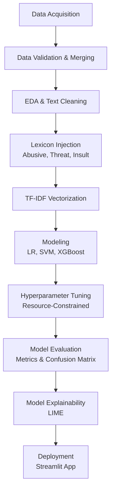

# Analisis Performa Algoritma Machine Learning untuk Klasifikasi Jenis dan Tingkat Keparahan Cyberbullying pada Teks Bahasa Indonesia Menggunakan TF-IDF

*(Performance Analysis of Machine Learning Algorithms for Cyberbullying Type and Severity Classification in Indonesian Text Using TF-IDF)*

---

## 1. Problem Statement & Latar Belakang

Perkembangan pesat media sosial dan platform komunikasi digital telah mempermudah masyarakat untuk berinteraksi dan berbagi pendapat. Namun, hal ini juga memicu peningkatan perilaku daring yang negatif, salah satunya adalah perundungan dunia maya (*cyberbullying*).

Berbeda dengan perundungan tradisional, *cyberbullying* dapat terjadi secara terus-menerus, menyebar dengan sangat cepat, mencapai audiens yang luas, dan meninggalkan jejak digital yang permanen. Deteksi *cyberbullying* pada teks berbahasa Indonesia memiliki tantangan tersendiri, mengingat penggunaan bahasa informal, *slang*, singkatan, kesalahan ejaan (*typo*), bahasa campuran, serta ekspresi yang sangat bergantung pada konteks kalimat.

Sebagai contoh, kalimat *"Dasar bodoh"* bisa jadi merupakan candaan antarteman akrab (Normal) atau sebuah serangan verbal (Insult/Hate Speech) jika diarahkan kepada orang asing.

**Tujuan Bisnis / Analisis:**
Proyek ini bertujuan untuk membangun dan mengevaluasi *pipeline Machine Learning* yang secara otomatis dapat mengklasifikasikan jenis perundungan siber (*Cyberbullying Type Classification*) pada teks bahasa Indonesia. Proyek ini membandingkan kinerja beberapa algoritma untuk menemukan model terbaik dalam menangani teks *sparse* berdimensi tinggi.

**Metrik Kesuksesan:**
Dikarenakan dataset *cyberbullying* sangat tidak seimbang (*imbalanced*), di mana jumlah teks yang mengandung tipe perundungan tertentu jauh lebih sedikit dibandingkan teks normal, metrik yang digunakan sebagai penentu kesuksesan adalah **F1-Macro Score**. F1-Macro memastikan bahwa kelas minoritas mendapat bobot yang sama pentingnya dengan kelas mayoritas.

---

## 2. Pipeline Proyek (Methodology)

Berikut adalah ilustrasi alur kerja *Machine Learning* secara *end-to-end* yang diterapkan dalam proyek ini:



---

## 3. Penjelasan Struktur Pipeline (End-to-End)

Proyek ini dibangun menggunakan pendekatan berlapis (modular) agar setiap proses dapat dievaluasi secara independen. Berikut adalah penjelasan rinci untuk setiap tahapan:

### A. Data Acquisition & Merging (Notebook 01)
Pada tahap ini, dataset dari berbagai platform dan penelitian sebelumnya (seperti dataset sentimen, *abusive*, *threat*, dan *insult*) dikumpulkan. Dataset tersebut digabungkan menjadi satu repositori utama (`data.csv`). Kami melakukan pemetaan kelas (*relabeling*) agar memiliki standar yang seragam (misal: label `HS` diubah menjadi `hate_speech`).

### B. Exploratory Data Analysis & Text Cleaning (Notebook 02-04)
Data yang tergabung divalidasi keutuhannya. Teks dibersihkan dari berbagai *noise* spesifik media sosial (URL, HTML tags, *username/mentions*, *hashtags*, dan tanda baca yang tidak relevan). Kami juga memastikan agar karakter alfanumerik dan spasi tetap rapi tanpa menghilangkan konteks emosional dari kalimat.

### C. Lexicon Injection (Notebook 05)
Kelemahan algoritma klasik adalah ketidakmampuannya memahami makna kata. Sebagai solusi inovatif, kami menyuntikkan teknik **Lexicon Tagging**. Jika algoritma menemukan kata yang cocok dengan kamus referensi pelecehan (*abusive.csv, threat.csv, dll.*), ia akan menempelkan tag khusus (misal: `tagabusive`) di akhir kalimat. Hal ini memaksa TF-IDF memberikan bobot matematis yang besar pada sentimen negatif tersebut.

### D. Ekstraksi Fitur TF-IDF (Notebook 06)
Teks yang sudah bersih dan diinjeksi kamus diubah menjadi bentuk numerik menggunakan *Term Frequency-Inverse Document Frequency* (TF-IDF). Parameter TF-IDF dikalibrasi ketat:
- **N-gram Range**: (1, 3) untuk menangkap frasa hingga 3 kata.
- **Max Features**: Dibatasi untuk menghindari ledakan memori RAM (batas ~60.000 fitur).

### E. Modeling & Pemilihan Algoritma (Notebook 07)
Tiga model *Machine Learning* yang terbukti tangguh terhadap matriks *sparse* berdimensi tinggi dilatih secara komparatif:
1. **Logistic Regression**: Sebagai *baseline* statistik yang kuat.
2. **Linear SVM**: Sangat optimal untuk mencari pembatas (*hyperplane*) di dimensi yang luas.
3. **XGBoost**: Algoritma ansambel modern yang dioptimalkan untuk memori (*Hist* tree method).

### F. Hyperparameter Tuning Terbatas Sumber Daya (Notebook 08)
Untuk mendapatkan performa maksimal, model disetel menggunakan *GridSearch/RandomizedSearch*. Khusus pada tahap ini, dilakukan pembatasan ketat terhadap utilitas komputasi (`n_jobs=2`, `pre_dispatch=2`) dan dipaksa menggunakan CPU untuk menghindari masalah fatal *CUDA Out of Memory* mengingat matriks TF-IDF memakan RAM yang sangat besar.

### G. Evaluasi & Error Analysis (Notebook 09-10)
Setiap model dinilai tidak hanya melalui akurasi, tetapi menggunakan **F1-Macro**. Analisis kesalahan (Error Analysis) dilakukan secara visual untuk melacak di kelas mana model sering terkecoh.


*Gambar: Visualisasi Error Analysis untuk melihat distribusi kesalahan prediksi antar kelas.*

### H. Model Explainability (Notebook 11)
AI sering kali dianggap sebagai "Kotak Hitam". Proyek ini menggunakan **LIME (Local Interpretable Model-agnostic Explanations)** untuk membongkar kotak hitam tersebut, memperlihatkan kata spesifik apa yang membuat model memutuskan sebuah kalimat tergolong *cyberbullying*.


*Gambar: Kata-kata teratas (Top Words) yang paling berpengaruh terhadap setiap kelas.*

---

## 4. Hasil dan Analisis

Berdasarkan tahap evaluasi terakhir (`reports/model_selection.json`), model terbaik yang berhasil memenangkan kompetisi perbandingan algoritma ini adalah **Linear SVM**.

### Metrik Performa (Linear SVM - Baseline):
- **Accuracy**: 79.56%
- **Precision**: 67.16%
- **Recall**: 66.70%
- **F1-Score (Macro)**: **66.87%**

**Analisis Kemenangan Linear SVM:**
F1-Macro Score sebesar ~66.8% menunjukkan bahwa model mampu menyeimbangkan prediksi pada kelas perundungan mayoritas dan minoritas dengan presisi yang sangat baik. Linear SVM berhasil mengalahkan XGBoost dan Logistic Regression karena sifat aslinya yang sangat superior dalam mencari batas pemisah (*margin*) pada matriks *sparse* (TF-IDF) yang memiliki dimensi berukuran masif (puluhan ribu kolom fitur kata). 


*Gambar: Confusion Matrix dari Linear SVM. Diagonal utama menunjukkan prediksi yang tepat, sementara titik di luar diagonal merepresentasikan kesalahan prediksi akibat ambiguitas semantik kalimat.*

---

## 5. Struktur Repositori

Struktur direktori ini dirancang rapi sesuai standar industri untuk *Data Science* & *Machine Learning Engineering*:

```text
UAS-PM/
├── data/
│   ├── raw/             # Dataset mentah & kamus lexicon
│   ├── validated/       # Dataset hasil pembersihan tahap awal
│   └── processed/       # Dataset siap training & vektor TF-IDF
├── docs/                # Latar belakang & dokumen prasyarat proyek
├── models/              # Model terlatih (Pickle) & XGB mappings
├── notebooks/           
│   ├── 01 - 04          # EDA, Relabeling, Validation
│   ├── 05 - 08          # Preprocessing, TF-IDF, Modeling, Tuning
│   └── 09 - 11          # Evaluation, Model Selection, Explainability
├── reports/             # Hasil metrik, matriks kebingungan, JSON summary
├── streamlit/
│   └── app.py           # Aplikasi Web Interaktif Streamlit
├── README.md            # Dokumentasi utama proyek
└── requirements.txt     # Daftar dependencies
```

---

## 6. Cara Menjalankan Aplikasi (Deployment Demo)

Proyek ini telah dikemas menjadi aplikasi web interaktif yang memungkinkan Anda memasukkan teks secara *live*, melihat proses pembersihan secara transparan, serta memahami bagaimana kecerdasan buatan membaca kalimat melalui **LIME Explainability**.

### Menjalankan secara Lokal
1. Buka terminal dan pastikan Anda berada di direktori akar (*root*) proyek.
2. Aktifkan virtual environment Anda (jika ada).
3. Jalankan perintah berikut:
   ```bash
   streamlit run streamlit/app.py
   ```
4. *Browser* akan terbuka otomatis di alamat `http://localhost:8501`.

---

## 7. Referensi / Tautan Eksternal

- **Tautan Repositori GitHub**: [https://github.com/zappto/UAS-PM.git](https://github.com/zappto/UAS-PM.git)
- **Tautan Presentasi YouTube**: `[INSERT YOUTUBE LINK HERE]`
- **Tautan Deployment Streamlit Cloud**: `[INSERT CLOUD LINK HERE]`

---
*Proyek ini merupakan Capstone Ujian Akhir Semester Genap 2025/2026 Mata Kuliah Pembelajaran Mesin Universitas Dian Nuswantoro.*
