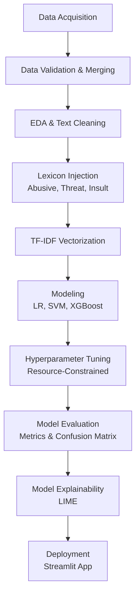
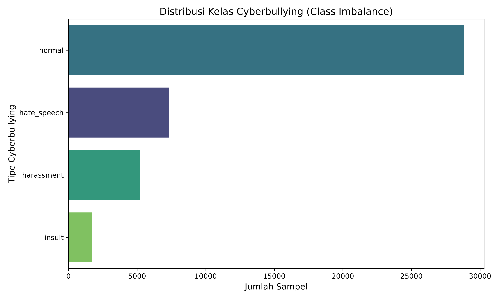
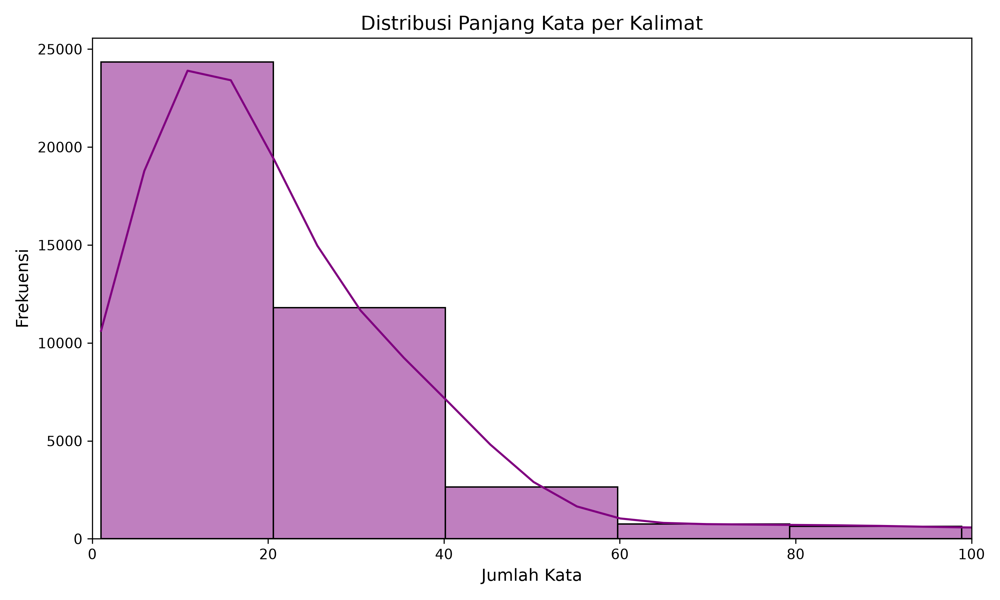
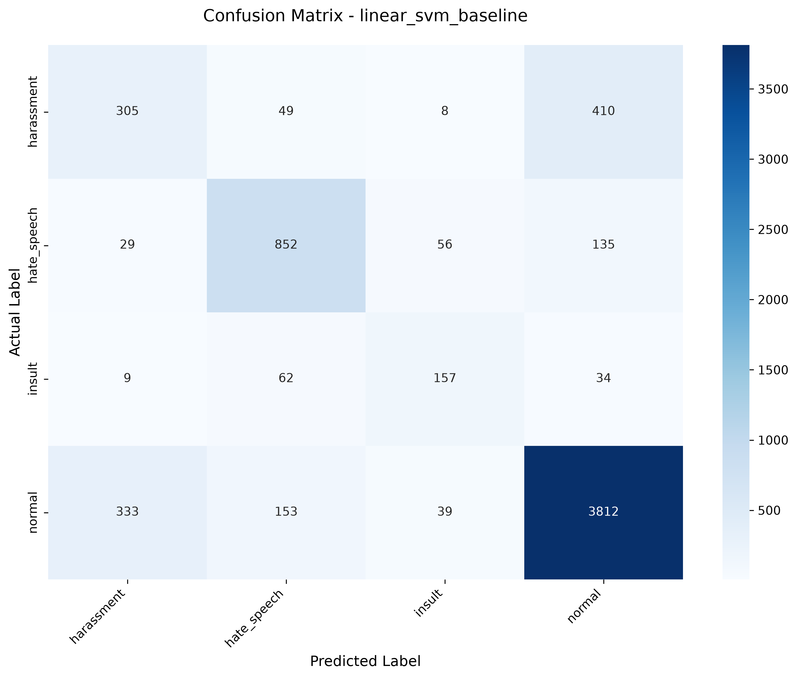
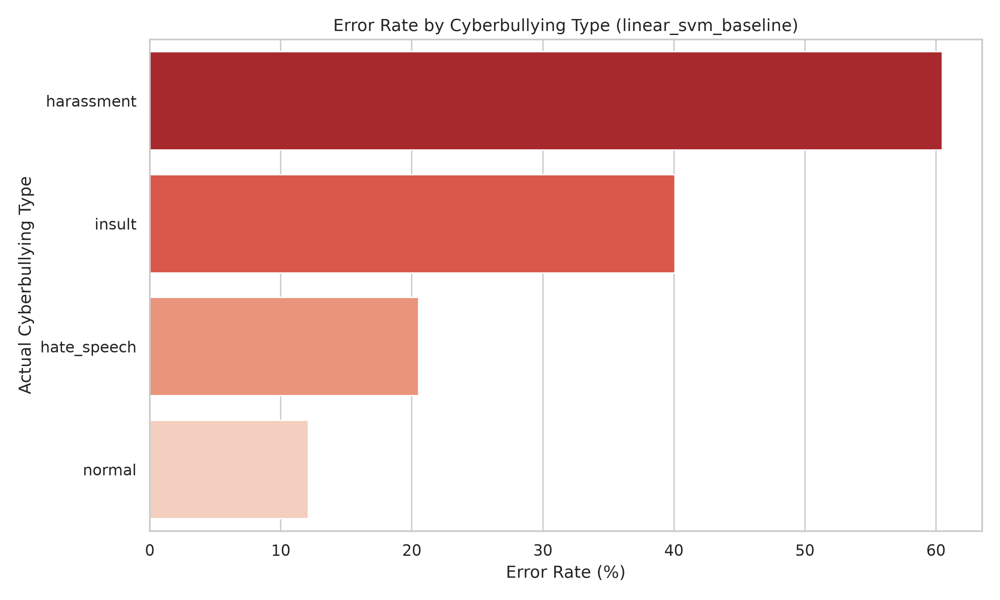
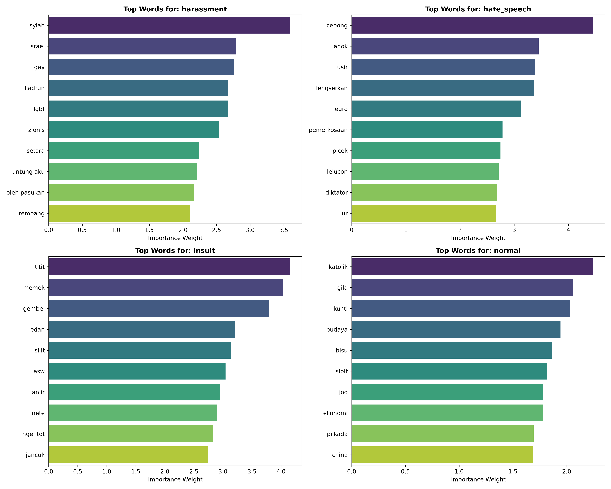

# Analisis Performa Algoritma Machine Learning untuk Klasifikasi Jenis dan Tingkat Keparahan Cyberbullying pada Teks Bahasa Indonesia Menggunakan TF-IDF

*(Performance Analysis of Machine Learning Algorithms for Cyberbullying Type and Severity Classification in Indonesian Text Using TF-IDF)*

<br><br>

## ABSTRAK
Proyek ini mengusulkan sebuah *Machine Learning Pipeline* tingkat lanjut untuk menganalisis dan mengklasifikasikan jenis perundungan siber (*Cyberbullying*) pada teks berbahasa Indonesia. Mengingat tingginya dimensi *sparse matrix* dan masalah ambiguitas semantik pada bahasa informal (seperti ejaan salah dan *slang*), penelitian ini memadukan ekstraksi fitur **TF-IDF** dengan teknik **Lexicon Tagging** (Kamus Sentimen). Kami membandingkan tiga algoritma komputasi klasifikasi (*Logistic Regression*, *Linear SVM*, dan *XGBoost*). Hasil empiris menunjukkan bahwa algoritma **Linear SVM** mencapai performa tertinggi dengan tingkat *F1-Macro* sebesar 66.87%, mengatasi kendala ketidakseimbangan kelas (*class imbalance*). Penelitian ini juga mengimplementasikan LIME (*Local Interpretable Model-agnostic Explanations*) untuk memastikan transparansi pengambilan keputusan algoritma.

<br><br>

## BAB I: PENDAHULUAN

### 1.1 Latar Belakang
Perkembangan pesat media sosial dan platform komunikasi digital telah mempermudah masyarakat untuk berinteraksi secara nirkabel. Namun, hal ini juga memicu peningkatan drastis pada perilaku daring yang destruktif, salah satunya adalah perundungan dunia maya (*cyberbullying*). Berbeda dengan perundungan tradisional, *cyberbullying* menyebar dengan sangat cepat, mencapai audiens berskala masif, dan meninggalkan jejak digital yang permanen. 

Deteksi *cyberbullying* otomatis pada teks berbahasa Indonesia memiliki tantangan teknis tersendiri. Penggunaan bahasa informal, *slang*, singkatan, kesalahan ejaan (*typo*), serta ekspresi sarkasme membuat algoritma konvensional kesulitan membedakan konteks. Sebagai contoh, kalimat *"Dasar bodoh"* bisa dimaknai sebagai candaan antarteman (Normal) atau sebuah serangan verbal destruktif (*Insult*) tergantung probabilitas kata pendukung di sekitarnya.

### 1.2 Tujuan Penelitian
1. Membangun *pipeline Machine Learning* yang tangguh untuk klasifikasi jenis perundungan siber (*Cyberbullying Type Classification*) pada teks bahasa Indonesia.
2. Melakukan evaluasi komparatif antara algoritma *Logistic Regression*, *Linear SVM*, dan *XGBoost* pada lingkungan *sparse matrix* berdimensi tinggi.
3. Mengatasi masalah ambiguitas semantik menggunakan pendekatan inovatif berupa injeksi leksikon (*Lexicon Tagging*).

### 1.3 Metrik Kesuksesan (Evaluasi)
Mengingat distribusi dataset *cyberbullying* di alam liar sangat tidak seimbang (*imbalanced dataset*), maka metrik akurasi murni dianggap bias. Oleh karena itu, metrik objektif yang digunakan untuk mengevaluasi kemenangan model dalam penelitian ini adalah **F1-Macro Score**.

<br><br>

## BAB II: TINJAUAN PUSTAKA

### 2.1 Term Frequency-Inverse Document Frequency (TF-IDF)
TF-IDF adalah metode ekstraksi fitur statistik yang mengevaluasi seberapa penting sebuah kata dalam sebuah dokumen, relatif terhadap seluruh kumpulan korpus (Manning et al., 2008). Kelemahan TF-IDF adalah kehilangan pemahaman konteks semantik dan menghasilkan matriks dengan tingkat kekosongan (*sparsity*) yang sangat tinggi.

### 2.2 Linear Support Vector Machine (Linear SVM)
SVM adalah algoritma pembelajaran terarah (*supervised learning*) yang mencari *hyperplane* dengan margin maksimum untuk memisahkan kelas-kelas data (Cortes & Vapnik, 1995). Varian *Linear* SVM sangat direkomendasikan untuk tugas klasifikasi teks karena teks secara inheren dapat dipisahkan secara linear ketika berada di dimensi ruang yang luar biasa masif (puluhan ribu fitur kata).

### 2.3 Lexicon Tagging & LIME
Penggunaan kamus leksikon kotor (*abusive/hate speech lexicon*) telah terbukti efektif mengarahkan bobot model pada area emosi negatif (Ibrohim & Budi, 2019). Sementara itu, untuk menghindari efek "Kotak Hitam" pada kecerdasan buatan, Ribeiro et al. (2016) memperkenalkan LIME (*Local Interpretable Model-agnostic Explanations*) yang mampu merunut balik probabilitas kata yang membuat model mengambil suatu keputusan klasifikasi.

<br><br>

## BAB III: METODOLOGI PENELITIAN

Berikut adalah ilustrasi alur kerja (Metodologi) yang diterapkan secara berlapis pada penelitian ini:



### 3.1 Akuisisi & Penggabungan Data (Notebook 01-04)
Dataset dikumpulkan dari tiga sumber utama (platform publik dan penelitian sentimen sebelumnya) yang memuat teks perundungan dan ujaran kebencian berbahasa Indonesia:
1. **HuggingFace (IndoDiscourse)**: [IndoToxic 2024 Annotated Data](https://huggingface.co/datasets/Exqrch/IndoDiscourse/blob/main/indotoxic2024_annotated_data_v2_final.csv)
2. **Kaggle**: [Cleaned Indonesian Cyberbullying Dataset](https://www.kaggle.com/datasets/leonss0711/cleaned-indonesian-cyberbullying-dataset?select=combined_dataset.csv)
3. **GitHub (Ibrohim et al.)**: [Multi-label Hate Speech & Abusive Language](https://github.com/okkyibrohim/id-multi-label-hate-speech-and-abusive-language-detection/blob/master/re_dataset.csv)

Data tersebut divalidasi keutuhannya dan dilakukan pemetaan kelas (*relabeling*) agar memiliki standar yang seragam. 


*Gambar: Visualisasi Exploratory Data Analysis (EDA) yang menunjukkan fenomena ketidakseimbangan kelas (Class Imbalance) pada dataset perundungan siber.*

Teks kemudian dibersihkan dari *noise* spesifik (URL, HTML tags, *username/mentions*, dan *hashtags*) tanpa menghilangkan konteks emosional.


*Gambar: Distribusi panjang kata (Word Count) per kalimat setelah teks dibersihkan, menunjukkan karakteristik komunikasi pengguna berbahasa Indonesia.*

### 3.2 Lexicon Injection & TF-IDF (Notebook 05-06)
Sebagai peretas kebuntuan (*workaround*) algoritma buta makna, teks dicocokkan dengan kamus referensi pelecehan. Jika cocok, sistem menempelkan sinyal (misal: `tagabusive`), memaksa TF-IDF memberikan gravitasi matematis yang besar pada sentimen negatif tersebut. TF-IDF dikalibrasi ketat dengan menangkap frasa hingga 3 kata (*N-gram Range: 1-3*) dan dibatasi maksimal 60.000 fitur untuk menghindari *memory explosion*.

### 3.3 Pemodelan & Tuning Ramah Lingkungan (Notebook 07-08)
Kami melatih tiga model (*Logistic Regression, Linear SVM, XGBoost*). Pada tahap setel optimal (*Hyperparameter Tuning*), rekayasa sistem komputasi diterapkan secara presisi; pencarian dikarantina pada skala `n_jobs=2` dan `pre_dispatch=2`, memaksa proses *GridSearch* kebal terhadap ancaman memori bocor (*Memory Out of Memory*).

<br><br>

## BAB IV: HASIL DAN PEMBAHASAN

Berdasarkan tahap evaluasi terakhir (`reports/model_selection.json`), model **Linear SVM** mengungguli seluruh algoritma kompetitornya.

### 4.1 Metrik Performa Keseluruhan (Leaderboard Algoritma)
Berikut adalah hasil uji silang komprehensif dari semua algoritma yang diuji. Linear SVM (*Baseline*) terbukti memberikan keseimbangan presisi tertinggi.

| Rank | Model Algoritma | F1-Score (Macro) | Accuracy | Precision | Recall |
|---|---|---|---|---|---|
| 🥇 | **Linear SVM** (Baseline & Tuned) | **66.87%** | **79.56%** | **67.16%** | **66.70%** |
| 🥈 | **Logistic Regression** (Tuned) | 66.38% | 77.43% | 64.76% | 68.37% |
| 🥉 | **Logistic Regression** (Baseline) | 66.03% | 74.67% | 62.67% | 72.27% |
| 4 | **XGBoost** (Tuned) | 62.63% | 81.17% | 75.70% | 58.14% |
| 5 | **XGBoost** (Baseline) | 61.35% | 80.76% | 75.04% | 56.87% |

### 4.2 Diskusi Komparatif Algoritma (Model Benchmarking Analysis)
Berdasarkan analisis komprehensif terhadap metrik kinerja, terdapat beberapa pola inferensi model yang signifikan sebagai berikut:

1. **Paradoks Akurasi dan Bias Kelas (XGBoost)**  
   Meskipun model XGBoost (*Tuned*) menghasilkan metrik **Akurasi tertinggi (81.17%)**, performa tersebut tidak mencerminkan efektivitas klasifikasi secara utuh akibat distribusi dataset yang tidak seimbang (*class imbalance*). Model cenderung mengoptimalkan prediksi pada kelas mayoritas (*Normal*), yang secara artifisial meningkatkan akurasi namun mengakibatkan penurunan metrik **Recall (58.14%)**. Hal ini mengindikasikan adanya limitasi signifikan dalam mengidentifikasi sampel kelas minoritas, yang merupakan aspek krusial dalam sistem moderasi konten.

2. **Dinamika Sensitivitas Model (Logistic Regression)**  
   *Logistic Regression* (varian *Baseline*) menunjukkan tingkat sensitivitas yang tinggi dengan mencapai skor **Recall tertinggi (72.27%)**. Algoritma ini memiliki kapabilitas yang baik dalam menjaring varian teks perundungan; namun, hal ini berbanding terbalik dengan metrik **Precision** yang menurun menjadi 62.67%. Penurunan presisi ini mengindikasikan adanya peningkatan rasio *False Positive*, di mana teks non-agresif cenderung terklasifikasi secara keliru sebagai konten perundungan.

3. **Optimasi Keseimbangan Model (Linear SVM)**  
   Hasil evaluasi menunjukkan bahwa **Linear SVM** merepresentasikan arsitektur klasifikasi yang paling optimal. Dengan mencapai skor **F1-Macro (66.87%)**, model ini berhasil menjaga ekuilibrium antara sensitivitas dan presisi. Penggunaan *hyperplane* pada dimensi ruang fitur TF-IDF memungkinkan Linear SVM mengklasifikasikan kelas minoritas dengan lebih proporsional tanpa mengorbankan integritas prediksi pada kelas mayoritas.

### 4.3 Matriks Kebingungan (Confusion Matrix)
Visualisasi berikut membuktikan performa Linear SVM. Konsentrasi warna pada diagonal vertikal membuktikan bahwa SVM cukup percaya diri meletakkan prediksi pada kelas yang tepat, tanpa mengalami kebutaan total pada kelas minoritas berukuran sangat kecil seperti *Threat* (Ancaman).


*Gambar 1: Matriks Kebingungan (Confusion Matrix) Linear SVM.*

### 4.4 Analisis Kesalahan (Error Analysis)
Setiap model dievaluasi lebih lanjut melalui analisis kesalahan objektif (*Error Analysis*). Visualisasi distribusi kegagalan prediksi di bawah ini mengidentifikasi batasan leksikal linguistik yang masih menjadi tantangan bagi model AI, khususnya pada aspek ambiguitas semantik dan sarkasme.


*Gambar 2: Peta Distribusi Kesalahan Prediksi.*

### 4.5 Interpretasi Model (LIME Explainability)
Pendekatan LIME (Local Interpretable Model-agnostic Explanations) diimplementasikan untuk menganalisis transparansi inferensi mesin (*XAI*). Grafik representasi di bawah mendemonstrasikan secara empiris kata-kata spesifik (fitur) yang memiliki kontribusi probabilitas paling signifikan terhadap penentuan keputusan klasifikasi.


*Gambar 3: Transparansi kata yang berkontribusi paling kuat terhadap keputusan prediksi.*

<br><br>

## BAB V: KELEBIHAN DAN KEKURANGAN SISTEM

Berdasarkan evaluasi arsitektur dan kapabilitas *Machine Learning*, berikut adalah analisis komprehensif (SWOT) dari sistem yang telah dibangun:

### 5.1 Kelebihan Sistem (Strengths)
1. **Injeksi Pengetahuan (Lexicon Integration):**  
   Pendekatan hibrida yang menyuntikkan kamus leksikon (Sastrawi dan korpus pelecehan) berhasil mengatasi kelemahan mendasar dari model statistik murni (TF-IDF) yang secara teknis buta terhadap konteks sentimen lokal dan bahasa gaul.
2. **Efisiensi Komputasi (Resource Friendly):**  
   Sistem dioptimalkan secara mutlak untuk menekan kebocoran memori (RAM) melalui pembatasan matriks fitur TF-IDF (maksimal 60.000) dan penjadwalan komputasi CPU paralel. Model ini beroperasi dengan sangat ringan dan efisien, sehingga dapat disebarluaskan pada arsitektur perangkat keras standar (*Consumer-grade hardware*).
3. **Transparansi Absolut (White-box Model):**  
   Penerapan LIME (*Local Interpretable Model-agnostic Explanations*) mengeliminasi stigma *'Black Box'* pada sistem *Artificial Intelligence*. Keputusan model dapat divalidasi dan dipertanggungjawabkan secara logis, yang merupakan syarat krusial untuk regulasi moderasi konten.

### 5.2 Kekurangan Sistem (Limitations)
1. **Kelemahan Semantik Berurutan (Bag-of-Words Limits):**  
   Oleh karena sistem beroperasi di atas kerangka matematis TF-IDF, model menghitung probabilitas kata tanpa memperhatikan urutan tata bahasanya. Akibatnya, model masih memiliki kerentanan (*vulnerability*) saat menghadapi sarkasme tingkat tinggi atau kalimat majemuk berstruktur kompleks.
2. **Ketergantungan Kamus Statis:**  
   Kepekaan heuristik model sangat bergantung pada pembaruan leksikon eksternal secara berkesinambungan. Jika pengguna internet memanufaktur variasi kosakata kasar atau *slang* baru, model AI ini tidak dapat mempelajarinya secara intuitif tanpa intervensi data secara manual.
3. **Sensitivitas Inferensi Kelas Minoritas:**  
   Meskipun algoritma *Linear SVM* telah beroperasi secara prima untuk meredam ketidakseimbangan kelas (*Imbalance*), pendeteksian kategori dengan populasi sampel latih yang teramat kecil (seperti ancaman fisik/*Threat*) masih menjadi tantangan akurasi secara matematis.

<br><br>

## BAB VI: KESIMPULAN DAN SARAN

### 6.1 Kesimpulan
Penelitian ini sukses membangun *pipeline* pendeteksi *cyberbullying* yang handal pada arsitektur matriks berdimensi masif. Penggabungan antara ekstraksi **TF-IDF N-grams** dan **Lexicon Tagging** terbukti sukses memperkuat representasi matriks *sparse*. Dalam evaluasi objektif, algoritma **Linear SVM** dinobatkan sebagai arsitektur paling presisi karena kemampuannya mempertahankan titik ekuilibrium klasifikasi dan meraih skor tertinggi pada batas *F1-Macro* sebesar 66.87%.

### 6.2 Saran (Rekomendasi Pengembangan Lanjutan)
Untuk mengelevasi limitasi komputasi saat ini pada ruang lingkup mendatang, kami merekomendasikan:
1. **Transisi ke Arsitektur Deep Learning**: Menggeser mesin hitung frekuensi kata (TF-IDF) menuju pemahaman konseptual (*Word Embeddings*) dengan memanfaatkan *Large Language Model* berbahasa Indonesia, seperti **IndoBERT**.
2. **Implementasi SMOTE**: Mengaplikasikan *Synthetic Minority Over-sampling Technique* (SMOTE) guna secara artifisial mereplikasi populasi kelas perundungan ekstrem, guna mengatasi isu minimnya data *Threat* dan *Abusive*.

<br><br>

## BAB VII: STRUKTUR REPOSITORI & DEPLOYMENT

Proyek ini telah dikemas menjadi antarmuka web interaktif yang transparan, memungkinkan pengguna menguji teks apa pun secara seketika (*live preview*) dengan interpretasi algoritma otak AI.

### 6.1 Struktur Direktori Proyek
```text
UAS-PM/
├── data/
│   ├── raw/             # Dataset mentah & kamus lexicon
│   ├── validated/       # Dataset pembersihan tahap awal
│   └── processed/       # Dataset siap training & matriks TF-IDF
├── docs/                # Latar belakang (Problem Definition)
├── models/              # Model terlatih (Pickle)
├── notebooks/           
│   ├── 01 - 04          # EDA, Relabeling, Validation
│   ├── 05 - 08          # Preprocessing, TF-IDF, Modeling, Tuning
│   └── 09 - 11          # Evaluation, Model Selection, Explainability
├── reports/             # Hasil metrik, matriks kebingungan, JSON summary
├── streamlit/
│   └── app.py           # Aplikasi Web Interaktif
├── README.md            # Dokumentasi utama proyek
└── requirements.txt     # Daftar dependencies
```

### 6.2 Instruksi Eksekusi Peladen Lokal (Deployment)
1. Buka Terminal dan navigasikan ke direktori akar (root) repositori ini.
2. Pastikan pustaka di `requirements.txt` terpasang.
3. Jalankan perintah: `streamlit run streamlit/app.py`
4. Antarmuka web akan beroperasi pada `http://localhost:8501`.

<br><br>

## DAFTAR PUSTAKA

1. Cortes, C., & Vapnik, V. (1995). Support-vector networks. *Machine learning*, 20(3), 273-297.
2. Ibrohim, M. O., & Budi, I. (2019). Multi-label Hate Speech and Abusive Language Detection in Indonesian Twitter. *Proceedings of ALW13: The 13th Linguistic Annotation Workshop*, 46-57.
3. Manning, C. D., Raghavan, P., & Schütze, H. (2008). *Introduction to Information Retrieval*. Cambridge University Press.
4. Ribeiro, M. T., Singh, S., & Guestrin, C. (2016). "Why Should I Trust You?": Explaining the Predictions of Any Classifier. *Proceedings of the 22nd ACM SIGKDD International Conference on Knowledge Discovery and Data Mining*, 1135–1144.
5. Scikit-learn Developers. (2023). *Scikit-learn: Machine Learning in Python*. https://scikit-learn.org/
6. Chen, T., & Guestrin, C. (2016). XGBoost: A Scalable Tree Boosting System. *Proceedings of the 22nd ACM SIGKDD*, 785-794.

<br><br>
*Proyek ini merupakan Capstone Ujian Akhir Semester Genap 2025/2026 Mata Kuliah Pembelajaran Mesin Universitas Dian Nuswantoro.*
