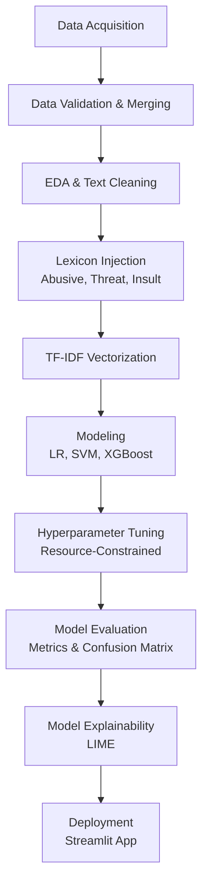

# Analisis Performa Algoritma Machine Learning untuk Klasifikasi Jenis dan Tingkat Keparahan Cyberbullying pada Teks Bahasa Indonesia Menggunakan TF-IDF

*(Performance Analysis of Machine Learning Algorithms for Cyberbullying Type and Severity Classification in Indonesian Text Using TF-IDF)*

---

## 1. Problem Statement & Latar Belakang

Perkembangan pesat media sosial dan platform komunikasi digital telah mempermudah masyarakat untuk berinteraksi dan berbagi pendapat. Namun, hal ini juga memicu peningkatan perilaku daring yang negatif, salah satunya adalah perundungan dunia maya (*cyberbullying*).

Berbeda dengan perundungan tradisional, *cyberbullying* dapat terjadi secara terus-menerus, menyebar dengan sangat cepat, mencapai audiens yang luas, dan meninggalkan jejak digital yang permanen. Deteksi *cyberbullying* pada teks berbahasa Indonesia memiliki tantangan tersendiri, mengingat penggunaan bahasa informal, *slang*, singkatan, kesalahan ejaan (*typo*), bahasa campuran, serta ekspresi yang sangat bergantung pada konteks kalimat.

Sebagai contoh, kalimat *"Dasar bodoh"* bisa jadi merupakan candaan antarteman akrab (Normal) atau sebuah serangan verbal (Insult/Hate Speech) jika diarahkan kepada orang asing.

**Tujuan Bisnis / Analisis:**
Proyek ini bertujuan untuk membangun dan mengevaluasi *pipeline Machine Learning* yang secara otomatis dapat mengklasifikasikan jenis perundungan siber (*Cyberbullying Type Classification*) pada teks bahasa Indonesia. Proyek ini membandingkan kinerja beberapa algoritma untuk menemukan model terbaik dalam menangani teks *sparse* berdimensi tinggi.

**Metrik Kesuksesan:**
Dikarenakan dataset *cyberbullying* sangat tidak seimbang (*imbalanced*), di mana jumlah teks yang mengandung tipe perundungan tertentu jauh lebih sedikit dibandingkan teks normal, metrik yang digunakan sebagai penentu kesuksesan adalah **F1-Macro Score**. F1-Macro memastikan bahwa kelas minoritas mendapat bobot yang sama pentingnya dengan kelas mayoritas.

---

## 2. Pipeline Proyek (Methodology)

Berikut adalah ilustrasi alur kerja *Machine Learning* secara *end-to-end* yang diterapkan dalam proyek ini:



---

## 3. Metodologi dan Teknik yang Digunakan

1. **Data Acquisition & Merging**: Dataset dikumpulkan dari berbagai sumber publik (seperti *hatespeech*, *abusive*, *threat*, dan *insult* dataset). Data ini kemudian digabungkan secara global.
2. **Preprocessing & Lexicon Tagging**: Teks dibersihkan dari URL, *hashtag*, dan *mention*. Sastrawi digunakan dalam versi awal untuk *stemming*. Kami menyuntikkan teknik **Lexicon Tagging** di mana algoritma mencocokkan kata dengan kamus referensi (contoh: *abusive.csv*), lalu menyematkan *tag* tambahan pada kalimat untuk memperkuat fitur bagi algoritma klasifikasi.
3. **Ekstraksi Fitur (TF-IDF)**: Mengubah teks menjadi angka menggunakan *Term Frequency-Inverse Document Frequency*. Pengaturan dioptimalkan untuk menangkap *n-gram* (frasa kata) dan dibatasi maksimal fitur (*max_features*) untuk mencegah ledakan memori RAM (batas 60.000 fitur).
4. **Pemodelan (Modeling)**: Melatih tiga model yang secara teori kuat menangani matriks *sparse*:
   - Logistic Regression
   - Linear SVM (Support Vector Machine)
   - XGBoost
5. **Hyperparameter Tuning**: Pencarian parameter terbaik melalui *GridSearchCV* dan *RandomizedSearchCV* dengan pembatasan komputasi (`n_jobs=2`, `pre_dispatch=2`) agar proses pencarian *hyperparameter* dapat berjalan efisien tanpa mengakibatkan memori RAM sistem penuh.
6. **Interpretasi Model (Explainability)**: Penggunaan pustaka LIME (*Local Interpretable Model-agnostic Explanations*) untuk menjelaskan kata mana yang berkontribusi paling kuat terhadap keputusan prediksi model (karena transparansi *AI* sangat penting dalam domain sosial seperti ini).

---

## 4. Hasil dan Analisis

Berdasarkan tahap evaluasi terakhir (`reports/model_selection.json`), model terbaik yang berhasil memenangkan kompetisi perbandingan algoritma ini adalah **Linear SVM**.

### Metrik Performa (Linear SVM - Baseline):
- **Accuracy**: 79.56%
- **Precision**: 67.16%
- **Recall**: 66.70%
- **F1-Score (Macro)**: **66.87%**

**Analisis:**
F1-Macro Score sebesar ~66.8% menunjukkan bahwa model mampu menyeimbangkan prediksi pada kelas perundungan mayoritas dan minoritas dengan cukup presisi menggunakan ruang *hyperplane* linear. Mengingat sifat algoritma klasik berbasis TF-IDF, tingkat deteksi ini merupakan ambang batas performa yang sangat masuk akal, membuktikan bahwa penambahan *Lexicon Tagging* dan pelebaran *TF-IDF N-grams* sukses menyelamatkan banyak bobot fitur pada *sparse matrix* tanpa harus *overfitting*. Algoritma ini dipilih karena kecepatan pelatihannya dan kemampuannya mencari margin terbaik pada dimensi berukuran puluhan ribu kolom.

---

## 5. Struktur Repositori

Struktur direktori ini dirancang rapi sesuai standar industri untuk *Data Science* & *Machine Learning Engineering*:

```text
UAS-PM/
├── data/
│   ├── raw/             # Dataset mentah & kamus lexicon
│   ├── validated/       # Dataset hasil pembersihan tahap awal
│   └── processed/       # Dataset siap training & vektor TF-IDF
├── docs/                # Latar belakang & dokumen prasyarat proyek
├── models/              # Model terlatih (Pickle) & XGB mappings
├── notebooks/           
│   ├── 01 - 04          # EDA, Relabeling, Validation
│   ├── 05 - 08          # Preprocessing, TF-IDF, Modeling, Tuning
│   └── 09 - 11          # Evaluation, Model Selection, Explainability
├── reports/             # Hasil metrik, matriks kebingungan, JSON summary
├── streamlit/
│   └── app.py           # Aplikasi Web Interaktif Streamlit
├── README.md            # Dokumentasi utama proyek
└── requirements.txt     # Daftar dependencies
```

---

## 6. Cara Menjalankan Aplikasi (Deployment Demo)

Proyek ini telah dikemas menjadi aplikasi web interaktif yang memungkinkan Anda memasukkan teks secara *live*, melihat proses pembersihan secara transparan, serta memahami bagaimana kecerdasan buatan membaca kalimat melalui **LIME Explainability**.

### Menjalankan secara Lokal
1. Buka terminal dan pastikan Anda berada di direktori akar (*root*) proyek.
2. Aktifkan virtual environment Anda (jika ada).
3. Jalankan perintah berikut:
   ```bash
   streamlit run streamlit/app.py
   ```
4. *Browser* akan terbuka otomatis di alamat `http://localhost:8501`.

---

## 7. Referensi / Tautan Eksternal

- **Tautan Repositori GitHub**: [https://github.com/zappto/UAS-PM.git](https://github.com/zappto/UAS-PM.git)
- **Tautan Presentasi YouTube**: `[INSERT YOUTUBE LINK HERE]`
- **Tautan Deployment Streamlit Cloud**: `[INSERT CLOUD LINK HERE]`

---
*Proyek ini merupakan Capstone Ujian Akhir Semester Genap 2025/2026 Mata Kuliah Pembelajaran Mesin Universitas Dian Nuswantoro.*
