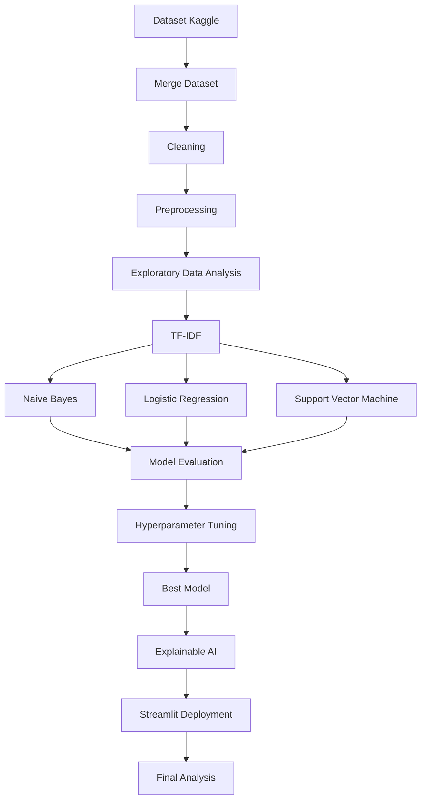
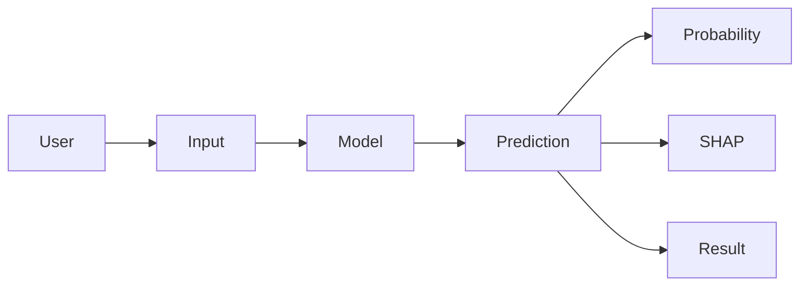

# Context Project

## Project Information

| Attribute      | Value                                      |
| -------------- | ------------------------------------------ |
| Course         | Machine Learning                           |
| Project Type   | Machine Learning Research & Implementation |
| Research Scope | Small Scale                                |
| Domain         | Natural Language Processing (NLP)          |
| Task           | Multi-Class Text Classification            |
| Language       | Bahasa Indonesia                           |
| Deployment     | Streamlit                                  |

---

# Research Title

**Analisis Performa Algoritma Machine Learning untuk Klasifikasi Jenis Cyberbullying pada Teks Bahasa Indonesia Menggunakan TF-IDF**

---

# Background

Cyberbullying merupakan salah satu bentuk perundungan yang banyak terjadi pada media digital dan media sosial. Seiring meningkatnya jumlah interaksi dalam bentuk teks, dibutuhkan pendekatan otomatis untuk membantu mengidentifikasi bentuk cyberbullying yang terdapat pada suatu komentar atau percakapan.

Sebagian besar penelitian hanya berfokus pada klasifikasi biner (Cyberbullying dan Non-Cyberbullying). Pendekatan tersebut belum memberikan informasi yang cukup mengenai jenis cyberbullying yang terkandung pada suatu teks.

Melalui penelitian ini akan dilakukan analisis performa beberapa algoritma Machine Learning dalam mengklasifikasikan jenis cyberbullying pada teks Bahasa Indonesia menggunakan representasi fitur TF-IDF.

---

# Research Problem

Bagaimana performa algoritma Machine Learning dalam mengklasifikasikan jenis cyberbullying pada teks Bahasa Indonesia menggunakan representasi fitur TF-IDF?

---

# Research Objective

1. Menganalisis performa beberapa algoritma Machine Learning dalam mengklasifikasikan jenis cyberbullying.
2. Membandingkan performa setiap algoritma berdasarkan metrik evaluasi.
3. Menentukan algoritma dengan performa terbaik.
4. Mengimplementasikan model terbaik ke dalam aplikasi sederhana menggunakan Streamlit.

---

# Research Scope

## Included

- Bahasa Indonesia
- Dataset Cyberbullying
- Text Classification
- TF-IDF
- Machine Learning
- Streamlit Deployment

## Excluded

- Deep Learning
- LLM
- BERT
- Image Classification
- Audio Classification
- Video Classification
- Real-time Detection
- Social Media Monitoring
- Severity Classification
- Sentiment Analysis

---

# Expected Output

## Research Output

- Performa setiap algoritma
- Perbandingan model
- Model terbaik
- Analisis hasil klasifikasi

---

## Machine Learning Output

- Predicted Label
- Probability Score
- Accuracy
- Precision
- Recall
- F1-Score
- Confusion Matrix
- ROC Curve
- Feature Importance (SHAP/LIME)

---

## Streamlit Output

### Input

User memasukkan teks.

### Output

- Predicted Class
- Confidence Score
- Probability Distribution
- Feature Importance
- Model Information

---

# Candidate Algorithms

- Naive Bayes
- Logistic Regression
- Support Vector Machine (SVM)

---

# Feature Extraction

TF-IDF (Term Frequency - Inverse Document Frequency)

---

# Evaluation Metrics

- Accuracy
- Precision
- Recall
- F1-Score
- ROC Curve
- Confusion Matrix

---

# Explainable AI

Minimal menggunakan salah satu:

- SHAP (Recommended)
- LIME

---

# Dataset

Source:

- Kaggle

Dataset Criteria:

- Bahasa Indonesia
- Label jelas
- Multi-class
- Public Dataset
- Dapat digunakan untuk penelitian akademik

Dataset dapat berasal dari beberapa dataset Kaggle yang memiliki label konsisten.

---

# Development Flow

---

# Streamlit Flow

---

# Project Deliverables

## Report

- BAB I
- BAB II
- BAB III
- BAB IV
- BAB V

---

## Source Code

- Notebook
- Dataset
- Streamlit App

---

## Documentation

- README
- Installation Guide
- User Guide

---

# Project Success Criteria

Penelitian dianggap berhasil apabila:

- Dataset berhasil diproses dengan baik.
- Seluruh preprocessing berhasil dilakukan.
- TF-IDF berhasil membentuk representasi fitur.
- Seluruh algoritma berhasil dilatih.
- Dilakukan evaluasi menggunakan metrik klasifikasi.
- Diperoleh algoritma dengan performa terbaik.
- Model berhasil diimplementasikan pada aplikasi Streamlit.
- Hasil penelitian dapat menjawab rumusan masalah yang telah ditetapkan.

---

# Notes

Penelitian ini berfokus pada **analisis performa algoritma Machine Learning** dalam melakukan **klasifikasi jenis cyberbullying** pada teks Bahasa Indonesia.

Fokus penelitian **bukan** membangun sistem moderasi media sosial, bukan melakukan monitoring media sosial secara real-time, dan bukan melakukan klasifikasi tingkat keparahan. Implementasi menggunakan Streamlit hanya berfungsi sebagai media demonstrasi hasil model Machine Learning yang telah dibangun.
