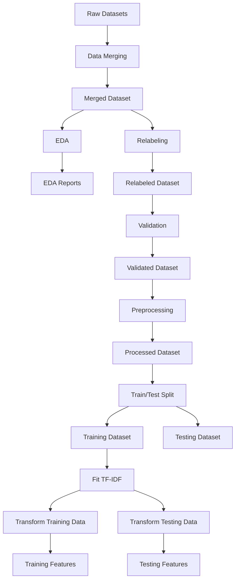

# Data Requirements Document (DRD)

# Performance Analysis of Machine Learning Algorithms for Cyberbullying Type Classification on Indonesian Text Using TF-IDF

---

# 1. Document Overview

This document defines the data requirements for the Machine Learning research project.

The project focuses on classifying cyberbullying types in Indonesian-language text using TF-IDF and classical Machine Learning algorithms.

The data pipeline must prioritize:

- Data quality.
- Data consistency.
- Label consistency.
- Reproducibility.
- Traceability.
- Data leakage prevention.

The dataset must pass through several controlled stages:

```text
Raw Dataset
      ↓
Merged Dataset
      ↓
Relabeled Dataset
      ↓
Validated Dataset
      ↓
Preprocessed Dataset
      ↓
TF-IDF Features
      ↓
Machine Learning Models
```

---

# 2. Data Objectives

The data pipeline must provide a dataset that is:

- Relevant to Indonesian-language cyberbullying classification.
- Consistent in structure.
- Consistent in label definitions.
- Free from critical data quality problems.
- Suitable for text preprocessing.
- Suitable for TF-IDF feature extraction.
- Suitable for Machine Learning training and evaluation.

The final dataset must support the following research objective:

> Classify Indonesian-language text into different types of cyberbullying using TF-IDF-based Machine Learning models.

---

# 3. Data Scope

The project focuses on:

- Indonesian-language text.
- Social media-style text.
- User-generated text.
- Cyberbullying-related text.
- Multi-class classification.

The dataset should contain examples representing the following classes:

```text
normal
insult
harassment
threat
hate_speech
```

---

# 4. Required Dataset Structure

The minimum required dataset structure is:

| Column  | Type               | Required | Description                        |
| ------- | ------------------ | -------- | ---------------------------------- |
| `text`  | String             | Yes      | Original Indonesian-language text  |
| `label` | Categorical/String | Yes      | Cyberbullying classification label |

Example:

```csv
text,label
"hari ini cuacanya sangat bagus",normal
"dasar bodoh",insult
"kamu akan menyesal",threat
```

---

# 5. Required Dataset Columns

## 5.1 `text`

The `text` column contains the original text.

Requirements:

- Must contain Indonesian-language text.
- Must not be entirely empty.
- Must be stored as a string.
- Must preserve the original text before preprocessing.
- Must not be modified during dataset merging.

Example:

```text
"Dasar bodoh, tidak ada yang suka sama kamu!"
```

The original text must be preserved for:

- Data inspection.
- Relabeling.
- Error analysis.
- Research reporting.

---

## 5.2 `label`

The `label` column contains the target classification category.

Allowed labels:

```text
normal
insult
harassment
threat
hate_speech
```

The label must:

- Be present.
- Not be empty.
- Use standardized naming.
- Not contain unexpected categories.
- Remain consistent throughout the pipeline.

---

# 6. Label Definitions

The following definitions must be used consistently.

---

## 6.1 `normal`

Text that does not contain a clear cyberbullying behavior.

Examples may include:

```text
"Hari ini saya pergi ke kampus."
```

```text
"Cuaca hari ini sangat panas."
```

The text may contain negative opinions but should not clearly represent cyberbullying according to the project labeling criteria.

---

## 6.2 `insult`

Text containing direct insults, derogatory expressions, or offensive language directed toward an individual or group.

Examples may include:

```text
"Dasar bodoh."
```

```text
"Kamu memang tolol."
```

The primary characteristic is direct offensive or insulting language.

---

## 6.3 `harassment`

Text involving repeated, targeted, aggressive, or abusive behavior directed toward a person or group.

The category may include:

- Persistent verbal abuse.
- Targeted intimidation.
- Repeated aggressive attacks.
- Targeted humiliation.

The distinction between `insult` and `harassment` must be determined based on context and the labeling guidelines used in the dataset.

---

## 6.4 `threat`

Text expressing an intention to cause harm, violence, or other serious negative consequences.

Examples may include:

```text
"Aku akan menghancurkanmu."
```

```text
"Kamu tunggu saja, nanti aku cari."
```

The key characteristic is an expression of potential harm or serious consequence.

---

## 6.5 `hate_speech`

Text attacking or expressing hostility toward an individual or group based on protected or group-related characteristics.

The exact labeling criteria must follow the dataset labeling guidelines.

The category must not be assigned solely because a text is offensive.

---

# 7. Data Sources

The dataset may be constructed from multiple publicly available datasets.

Potential sources include:

- Public dataset repositories.
- Research datasets.
- Publicly available Indonesian social media text datasets.

Each source dataset must be documented.

At minimum, record:

| Information      | Description                  |
| ---------------- | ---------------------------- |
| Dataset Name     | Name of the source dataset   |
| Source           | Repository or platform       |
| Original File    | Original filename            |
| Original Columns | Available columns            |
| Original Labels  | Original label categories    |
| Language         | Dataset language             |
| Number of Rows   | Number of records            |
| License          | Dataset license if available |
| Usage Notes      | Relevant limitations         |

---

# 8. Raw Data Requirements

Raw datasets must be stored in:

```text
data/raw/
```

Example:

```text
data/raw/
├── dataset_1.csv
├── dataset_2.csv
└── dataset_3.csv
```

Raw files must:

- Remain unchanged.
- Preserve the original dataset format.
- Not be overwritten by processing steps.
- Be used as the original source of the data pipeline.

The raw dataset is the source of truth for the original data.

---

# 9. Dataset Merging Requirements

The merging process is performed in:

```text
notebooks/01_data_merging.ipynb
```

The notebook must:

1. Load all relevant raw datasets.

2. Inspect the structure of each dataset.

3. Identify text columns.

4. Identify label columns.

5. Standardize column names.

6. Map source labels to project labels.

7. Select compatible records.

8. Merge the datasets.

9. Save the merged dataset.

Output:

```text
data/merged/merged_dataset.csv
```

The merged dataset must contain at least:

```text
text
label
```

---

# 10. Dataset Source Mapping

When different datasets use different column names, they must be mapped to the standard structure.

Example:

| Source Column | Standard Column |
| ------------- | --------------- |
| `comment`     | `text`          |
| `tweet`       | `text`          |
| `content`     | `text`          |
| `sentence`    | `text`          |
| `category`    | `label`         |
| `class`       | `label`         |
| `target`      | `label`         |

The mapping must be documented inside:

```text
notebooks/01_data_merging.ipynb
```

---

# 11. Label Mapping Requirements

Different datasets may use different label systems.

Example:

```text
Dataset A:
0 → normal
1 → insult

Dataset B:
non-bullying → normal
bullying → harassment
```

All source labels must be mapped to the project label system.

The mapping must be explicit.

Example:

```python
label_mapping = {
    "non-bullying": "normal",
    "insulting": "insult",
    "abusive": "harassment",
    "threatening": "threat",
    "hate": "hate_speech"
}
```

The project must not silently merge semantically different labels without documentation.

---

# 12. Exploratory Data Analysis Requirements

EDA is performed in:

```text
notebooks/02_eda.ipynb
```

The EDA stage must analyze the merged dataset before relabeling and validation.

---

## 12.1 Dataset Size

The following must be reported:

- Total number of rows.
- Number of columns.
- Number of records per source dataset if available.

---

## 12.2 Missing Values

The following must be analyzed:

- Missing text.
- Missing labels.
- Null values.
- Empty strings.

---

## 12.3 Label Distribution

The number of samples per label must be calculated.

Example:

| Label       | Count | Percentage |
| ----------- | ----: | ---------: |
| normal      |  5000 |        40% |
| insult      |  3000 |        24% |
| harassment  |  2500 |        20% |
| threat      |  1000 |         8% |
| hate_speech |  1000 |         8% |

The actual values depend on the dataset.

---

## 12.4 Text Length

Text length analysis should include:

- Character count.
- Word count.
- Minimum length.
- Maximum length.
- Average length.
- Median length.

This helps identify:

- Empty or extremely short text.
- Extremely long text.
- Outliers.

---

## 12.5 Duplicate Analysis

The EDA stage should analyze:

- Exact duplicate rows.
- Duplicate text.
- Duplicate text with different labels.

These categories must be distinguished.

---

# 13. Relabeling Requirements

Relabeling is performed in:

```text
notebooks/03_relabeling.ipynb
```

The goal is to improve label consistency.

The notebook must identify potential label conflicts.

The primary conflict pattern is:

```text
Same Text
      ↓
Different Labels
```

Example:

```text
Text:
"dasar bodoh"

Labels:
insult
harassment
```

These records require manual review.

---

# 14. Relabeling Review File

Potential conflicts should be exported to:

```text
reports/relabeling/label_conflicts.csv
```

Recommended columns:

| Column             | Description                   |
| ------------------ | ----------------------------- |
| `text`             | Conflicting text              |
| `current_labels`   | Existing labels               |
| `occurrence_count` | Number of occurrences         |
| `final_label`      | Manually selected final label |
| `review_status`    | Review state                  |
| `review_notes`     | Reason for decision           |

Example:

```csv
text,current_labels,occurrence_count,final_label,review_status,review_notes
"dasar bodoh","insult|harassment",2,"insult","RESOLVED","Direct insult"
```

---

# 15. Manual Review Requirements

Potential conflicts must not be automatically resolved without a defined rule.

Recommended review statuses:

```text
PENDING
RESOLVED
REMOVED
UNCERTAIN
```

The final decision should be based on:

- Text meaning.
- Label definitions.
- Dataset context.
- Research labeling criteria.

The review process must be documented.

---

# 16. Relabeled Dataset Requirements

After relabeling, the dataset must be saved to:

```text
data/relabeled/relabeled_dataset.csv
```

The dataset must contain:

```text
text
label
```

The relabeled dataset must preserve the original text.

---

# 17. Dataset Validation Requirements

Validation is performed in:

```text
notebooks/04_validation.ipynb
```

The validation stage must verify that the dataset is ready for preprocessing.

---

## 17.1 Missing Text Validation

The dataset must identify:

- Null text.
- Empty text.
- Whitespace-only text.

Example:

```text
null
""
"   "
```

These records should be reviewed and removed if they cannot provide useful information.

---

## 17.2 Missing Label Validation

Records without labels must be identified.

Example:

```text
text:
"dasar bodoh"

label:
NULL
```

Records without labels must not be used for supervised Machine Learning training.

---

## 17.3 Invalid Label Validation

All labels must belong to:

```text
normal
insult
harassment
threat
hate_speech
```

Any other label must be:

- Corrected.
- Mapped.
- Reviewed.
- Or removed.

---

# 18. Duplicate Data Requirements

Duplicate records must be categorized.

---

## 18.1 Exact Duplicate Rows

Example:

```text
text              label
-------------------------
dasar bodoh       insult
dasar bodoh       insult
```

These are exact duplicates.

The project must decide whether to:

- Keep one record.
- Remove duplicates.

The decision must be documented.

---

## 18.2 Duplicate Text with Same Label

Example:

```text
text              label
-------------------------
dasar bodoh       insult
dasar bodoh       insult
```

This is a redundancy issue.

---

## 18.3 Duplicate Text with Conflicting Labels

Example:

```text
text              label
-------------------------
dasar bodoh       insult
dasar bodoh       harassment
```

This is a label conflict.

It must be analyzed separately.

---

# 19. Validated Dataset Requirements

After validation, the final dataset must be saved to:

```text
data/validated/validated_dataset.csv
```

The validated dataset must:

- Contain valid text.
- Contain valid labels.
- Use standardized labels.
- Have no unresolved critical label conflicts.
- Be suitable for preprocessing.

---

# 20. Text Preprocessing Data Requirements

Preprocessing is performed in:

```text
notebooks/05_preprocessing.ipynb
```

The preprocessing process must generate:

```text
text
clean_text
label
```

Example:

```text
text:
"Dasar GOBLOKKK banget!!!"

clean_text:
"dasar goblok banget"

label:
insult
```

---

# 21. Indonesian Text Processing Requirements

The preprocessing pipeline may include:

```text
Original Text
      ↓
Lowercase
      ↓
URL Removal
      ↓
Mention Removal
      ↓
Special Character Handling
      ↓
Slang Normalization
      ↓
Repeated Character Normalization
      ↓
Tokenization
      ↓
Stopword Handling
      ↓
Stemming
      ↓
Clean Text
```

The exact preprocessing operations must be documented.

The preprocessing must be consistent between:

- Training.
- Evaluation.
- Streamlit inference.

---

# 22. Original Text Preservation

The original text must not be overwritten.

The dataset should preserve:

```text
text
```

and create:

```text
clean_text
```

This is necessary for:

- Error analysis.
- Manual review.
- Research reporting.
- Explainability.

---

# 23. TF-IDF Data Requirements

TF-IDF processing is performed in:

```text
notebooks/06_tfidf.ipynb
```

The dataset must first be split into training and testing data.

Recommended:

```text
Training Data: 80%
Testing Data: 20%
```

The split should use stratification.

---

# 24. TF-IDF Data Leakage Prevention

The correct process is:

```text
Validated Dataset
      ↓
Preprocessed Dataset
      ↓
Train/Test Split
      ↓
Fit TF-IDF on Training Data
      ↓
Transform Training Data
      ↓
Transform Testing Data
```

The TF-IDF vectorizer must not be fitted on the complete dataset before splitting.

The test data must remain unseen during feature fitting.

---

# 25. TF-IDF Outputs

The TF-IDF process should generate:

```text
models/tfidf_vectorizer.pkl
```

and:

```text
data/processed/
├── X_train.pkl
├── X_test.pkl
├── y_train.pkl
└── y_test.pkl
```

The exact file format may be adjusted based on the implementation.

---

# 26. Training Data Requirements

The training dataset must:

- Contain valid labels.
- Contain processed text.
- Be transformed using the training-fitted TF-IDF vectorizer.
- Not contain test data.

The training data is used for:

- Model fitting.
- Cross-validation.
- Hyperparameter tuning.

---

# 27. Testing Data Requirements

The testing dataset must:

- Remain unseen during training.
- Be transformed using the already-fitted TF-IDF vectorizer.
- Be used for final model evaluation.

The test dataset must not be used to directly select model hyperparameters.

---

# 28. Data Balance Requirements

The label distribution must be analyzed.

Class imbalance must be reported.

Example:

```text
normal       50%
insult       25%
harassment   15%
threat        5%
hate_speech   5%
```

The project must not automatically balance the dataset without justification.

Potential techniques may include:

- Class weights.
- Sampling strategies.

Any balancing strategy must be documented and justified.

---

# 29. Data Quality Requirements

The final dataset must satisfy the following:

| Requirement                       | Status   |
| --------------------------------- | -------- |
| Text column exists                | Required |
| Label column exists               | Required |
| Text is not empty                 | Required |
| Label is not empty                | Required |
| Labels are valid                  | Required |
| Critical label conflicts resolved | Required |
| Dataset is reproducible           | Required |
| Original text preserved           | Required |
| Data leakage prevented            | Required |

---

# 30. Dataset Version Flow

The dataset must follow this flow:

```text
data/raw/
      │
      ▼
data/merged/
      │
      ▼
data/relabeled/
      │
      ▼
data/validated/
      │
      ▼
data/processed/
```

Each stage must have a clear purpose.

---

# 31. Data Flow Diagram



---

# 32. Data Traceability

Every dataset transformation must be traceable.

The project must be able to answer:

```text
Where did this dataset come from?
```

```text
Which notebook generated it?
```

```text
What transformation was applied?
```

```text
Which dataset was used as input?
```

Example:

```text
data/raw/dataset_1.csv
        ↓
01_data_merging.ipynb
        ↓
data/merged/merged_dataset.csv
        ↓
03_relabeling.ipynb
        ↓
data/relabeled/relabeled_dataset.csv
```

---

# 33. Dataset Documentation Requirements

The project must document:

- Dataset source.
- Dataset license where available.
- Dataset size.
- Dataset columns.
- Label definitions.
- Label mapping.
- Dataset limitations.
- Data cleaning decisions.
- Relabeling decisions.
- Duplicate handling.
- Validation results.

This information may be stored in:

```text
README.md
```

and:

```text
reports/
```

---

# 34. Data Quality Reports

The following reports should be generated where applicable:

```text
reports/
├── eda/
├── relabeling/
├── validation/
├── training/
├── tuning/
├── evaluation/
├── error_analysis/
└── explainability/
```

These reports support:

- Research analysis.
- Debugging.
- Reproducibility.
- Academic documentation.

---

# 35. Data Requirements by Notebook

| Notebook                         | Input                     | Main Output            |
| -------------------------------- | ------------------------- | ---------------------- |
| `01_data_merging.ipynb`          | Raw datasets              | Merged dataset         |
| `02_eda.ipynb`                   | Merged dataset            | EDA reports            |
| `03_relabeling.ipynb`            | Merged dataset            | Relabeled dataset      |
| `04_validation.ipynb`            | Relabeled dataset         | Validated dataset      |
| `05_preprocessing.ipynb`         | Validated dataset         | Processed dataset      |
| `06_tfidf.ipynb`                 | Processed dataset         | TF-IDF features        |
| `07_model_training.ipynb`        | Training features         | Baseline models        |
| `08_hyperparameter_tuning.ipynb` | Training data             | Tuned model            |
| `09_model_evaluation.ipynb`      | Test data and models      | Evaluation reports     |
| `10_error_analysis.ipynb`        | Predictions               | Error reports          |
| `11_explainability.ipynb`        | Best model and vectorizer | Explainability reports |

---

# 36. Minimum Data Requirements

The minimum dataset must:

1. Contain Indonesian-language text.

2. Contain a text column.

3. Contain a label column.

4. Contain valid classification labels.

5. Contain sufficient examples for each target class.

6. Have its label distribution analyzed.

7. Have missing values reviewed.

8. Have duplicates reviewed.

9. Have label conflicts reviewed.

10. Be validated before Machine Learning training.

---

# 37. Final Data Pipeline

The complete data pipeline is:

```text
Raw Dataset
      ↓
Data Merging
      ↓
Merged Dataset
      ↓
EDA
      ↓
Relabeling
      ↓
Relabeled Dataset
      ↓
Validation
      ↓
Validated Dataset
      ↓
Preprocessing
      ↓
Processed Dataset
      ↓
Train/Test Split
      ↓
TF-IDF
      ↓
Training Features
      ↓
Testing Features
      ↓
Machine Learning Training
```

---

# 38. Final Data Principle

The most important data principle is:

> The quality and consistency of the dataset must be established before model training.

The project must not immediately train models on unreviewed data.

The complete data quality process is:

```text
Collect
  ↓
Inspect
  ↓
Merge
  ↓
Analyze
  ↓
Relabel
  ↓
Validate
  ↓
Preprocess
  ↓
Extract Features
  ↓
Train
```

The dataset must be treated as a research artifact.

Every major modification must be:

- Visible.
- Documented.
- Reproducible.
- Traceable.
