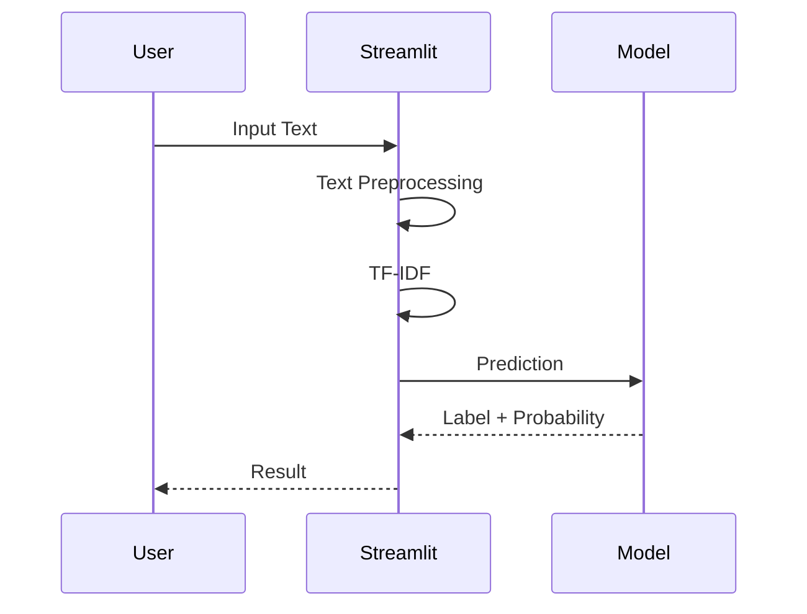

# Deployment Document

# Project Information

| Item            | Description                       |
| --------------- | --------------------------------- |
| Project         | Cyberbullying Text Classification |
| Deployment Type | Local Deployment                  |
| Framework       | Streamlit                         |
| Runtime         | Python 3.12+                      |
| Model Format    | Joblib (.pkl)                     |

---

# Purpose

Dokumen ini menjelaskan proses deployment model Machine Learning ke dalam aplikasi berbasis Streamlit.

Deployment bertujuan untuk mendemonstrasikan kemampuan model dalam melakukan klasifikasi jenis cyberbullying terhadap teks Bahasa Indonesia.

Deployment tidak ditujukan sebagai sistem produksi (production system), melainkan sebagai media demonstrasi hasil penelitian Machine Learning.

---

# Deployment Architecture

```mermaid
flowchart LR

User

-->

Streamlit UI

-->

Text Preprocessing

-->

TF-IDF Vectorizer

-->

Best Model

-->

Prediction

-->

Probability

-->

SHAP

-->

Result
```

---

# Deployment Workflow

```mermaid
flowchart TD

Training

↓

Model Evaluation

↓

Best Model Selected

↓

Save Model (.pkl)

↓

Load Model

↓

Streamlit

↓

Prediction

↓

Display Result
```

---

# Deployment Components

## Streamlit

Berfungsi sebagai antarmuka pengguna.

---

## TF-IDF Vectorizer

Mengubah input teks menjadi representasi numerik.

---

## Best Model

Model hasil evaluasi dengan performa terbaik.

---

## SHAP

Menampilkan interpretasi hasil prediksi.

---

# Required Files

```text
models/

│

├── best_model.pkl

├── tfidf.pkl

└── label_encoder.pkl
```

---

# User Flow



---

# Prediction Flow

```mermaid
flowchart TD

Input Text

↓

Cleaning

↓

Case Folding

↓

Tokenization

↓

Stopword Removal

↓

Stemming

↓

TF-IDF

↓

Prediction

↓

Probability

↓

SHAP

↓

Output
```

---

# Streamlit Pages

## Home

Menampilkan informasi penelitian.

---

## Dataset

Menampilkan ringkasan dataset.

Informasi:

- Jumlah Data
- Jumlah Label
- Distribusi Label

---

## Model Evaluation

Menampilkan hasil evaluasi model.

Visualisasi:

- Accuracy
- Precision
- Recall
- F1 Score
- Confusion Matrix
- ROC Curve

---

## Prediction

Input:

Teks Bahasa Indonesia

Output:

- Predicted Label
- Confidence Score
- Probability Distribution

---

## Explainability

Menampilkan visualisasi SHAP.

Output:

- Feature Importance
- Word Contribution
- Prediction Explanation

---

# Prediction Output

Contoh Input

```text
Dasar bodoh, kamu memang tidak berguna.
```

Output

```text
Prediction

Insult
```

Probability

| Label       | Probability |
| ----------- | ----------: |
| Insult      |      91.24% |
| Harassment  |       4.13% |
| Hate Speech |       2.16% |
| Threat      |       1.05% |
| Normal      |       1.42% |

---

# Explainability Output

Visualisasi SHAP menunjukkan kata-kata yang memiliki kontribusi terbesar terhadap hasil prediksi.

Contoh

| Word    | Contribution |
| ------- | -----------: |
| bodoh   |        +0.54 |
| tidak   |        +0.18 |
| berguna |        +0.12 |

---

# Deployment Environment

| Item             | Specification           |
| ---------------- | ----------------------- |
| Operating System | Windows / Linux / macOS |
| Python           | 3.12+                   |
| RAM              | Minimum 4 GB            |
| Browser          | Chrome / Edge / Firefox |

---

# Dependencies

```
streamlit
pandas
numpy
scikit-learn
joblib
nltk
sastrawi
shap
matplotlib
```

---

# Local Deployment

Install dependency

```bash
pip install -r requirements.txt
```

Run application

```bash
streamlit run streamlit/app.py
```

Application

```text
http://localhost:8501
```

---

# Model Loading

Saat aplikasi dijalankan, sistem akan memuat:

- TF-IDF Vectorizer
- Label Encoder
- Best Model

Model hanya dimuat satu kali saat startup untuk meningkatkan performa aplikasi.

---

# Error Handling

## Empty Input

Pesan

```
Silakan masukkan teks terlebih dahulu.
```

---

## Model Not Found

Pesan

```
Model tidak ditemukan.
```

---

## Invalid Model

Pesan

```
Gagal memuat model Machine Learning.
```

---

# Limitations

- Hanya mendukung Bahasa Indonesia.
- Hanya menerima input berupa teks.
- Tidak mendukung prediksi batch.
- Tidak melakukan training ulang melalui aplikasi.
- Tidak terhubung dengan media sosial secara langsung.

---

# Out of Scope

Deployment tidak mencakup:

- Docker
- Kubernetes
- REST API
- Cloud Deployment
- Authentication
- Database
- Multi-user Support
- Real-time Monitoring
- Continuous Training (MLOps)

---

# Deliverables

Deployment menghasilkan:

- Streamlit Application
- Trained Model
- TF-IDF Vectorizer
- Prediction Module
- Explainability Module
- User Documentation
