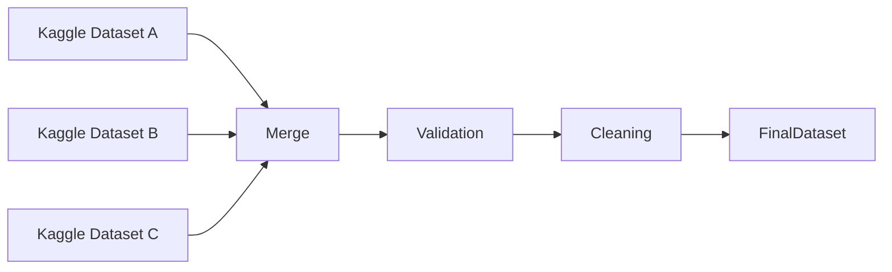
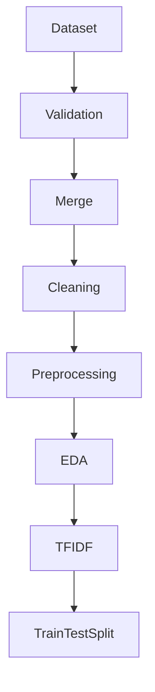

# Data Requirements Document (DRD)

# Project Information

| Item                | Description                       |
| ------------------- | --------------------------------- |
| Project             | Cyberbullying Text Classification |
| Domain              | Natural Language Processing (NLP) |
| Language            | Bahasa Indonesia                  |
| Dataset Source      | Kaggle                            |
| Data Type           | Text                              |
| Learning Type       | Supervised Learning               |
| Classification Type | Multi-Class Classification        |

---

# Purpose

Dokumen ini mendefinisikan kebutuhan data yang digunakan pada penelitian Machine Learning untuk melakukan klasifikasi jenis cyberbullying pada teks Bahasa Indonesia.

Dokumen ini menjadi acuan dalam proses pencarian dataset, validasi kualitas data, preprocessing, feature engineering, hingga proses training model.

---

# Dataset Requirements

Dataset harus memenuhi kriteria berikut.

| Requirement                              | Status    |
| ---------------------------------------- | --------- |
| Bahasa Indonesia                         | Required  |
| Public Dataset                           | Required  |
| Memiliki Label                           | Required  |
| Text Dataset                             | Required  |
| Multi-Class                              | Preferred |
| CSV Format                               | Preferred |
| Lisensi dapat digunakan untuk penelitian | Required  |

---

# Candidate Dataset Source

Prioritas sumber dataset.

1. Kaggle
2. GitHub Repository
3. HuggingFace Dataset

Dataset utama akan berasal dari Kaggle.

---

# Dataset Criteria

Dataset minimal memiliki kolom berikut.

| Column | Description           |
| ------ | --------------------- |
| text   | Komentar atau kalimat |
| label  | Jenis cyberbullying   |

Contoh

| text        | label  |
| ----------- | ------ |
| Dasar bodoh | insult |
| Kamu hebat  | normal |

---

# Label Requirements

Label harus bersifat konsisten.

Contoh

| Label       | Description                    |
| ----------- | ------------------------------ |
| normal      | Tidak mengandung cyberbullying |
| insult      | Menghina                       |
| harassment  | Pelecehan verbal               |
| threat      | Ancaman                        |
| hate_speech | Ujaran kebencian               |

Apabila menggunakan lebih dari satu dataset, maka seluruh label harus dinormalisasi terlebih dahulu.

---

# Data Quality Requirements

Dataset harus memenuhi kualitas berikut.

## Completeness

- Tidak memiliki nilai kosong pada kolom utama.

---

## Consistency

- Format label konsisten.
- Encoding UTF-8.

---

## Uniqueness

- Tidak terdapat data duplikat.

---

## Validity

- Seluruh data berupa teks.
- Label valid.

---

# Expected Dataset Size

| Category    | Target       |
| ----------- | ------------ |
| Minimum     | 5.000 Data   |
| Recommended | 10.000+ Data |

Apabila menggunakan beberapa dataset, seluruh dataset akan digabungkan setelah dilakukan normalisasi label.

---

# Data Collection Flow



---

# Data Validation

Dataset akan divalidasi berdasarkan beberapa aspek.

- Jumlah data
- Jumlah label
- Missing Value
- Duplicate
- Empty Text
- Invalid Character
- Label Distribution

---

# Data Cleaning

Tahapan cleaning meliputi.

- Remove Missing Value
- Remove Duplicate
- Remove Empty Text
- Remove URL
- Remove Mention
- Remove Hashtag
- Remove Emoji
- Remove HTML Tag
- Remove Punctuation
- Remove Number
- Remove Extra Space

---

# Text Preprocessing

Tahapan preprocessing.

1. Case Folding
2. Text Cleaning
3. Tokenization
4. Stopword Removal
5. Stemming
6. Join Token

---

# Feature Engineering

Representasi teks menggunakan.

TF-IDF

Output

```text
"Kamu bodoh sekali"

↓

[0.12,0.00,0.31,0.56,...]
```

---

# Data Split

Dataset dibagi menjadi.

| Dataset  | Percentage |
| -------- | ---------- |
| Training | 80%        |
| Testing  | 20%        |

Random State

42

Stratified Split

Enabled

---

# Exploratory Data Analysis

EDA minimal meliputi.

## Dataset Overview

- Jumlah Data
- Jumlah Label
- Jumlah Kata

---

## Label Distribution

Visualisasi jumlah data setiap label.

---

## Word Frequency

Top kata yang paling sering muncul.

---

## Text Length Distribution

Distribusi panjang teks.

---

## Missing Value

Visualisasi data kosong.

---

## Duplicate Data

Jumlah data duplikat.

---

# Data Pipeline



---

# Risks

| Risk                  | Mitigation                                         |
| --------------------- | -------------------------------------------------- |
| Label tidak konsisten | Normalisasi Label                                  |
| Dataset terlalu kecil | Menggabungkan beberapa dataset                     |
| Data tidak seimbang   | Stratified Split dan evaluasi menggunakan F1-Score |
| Banyak duplicate      | Remove Duplicate                                   |
| Banyak noise          | Data Cleaning                                      |

---

# Assumptions

- Dataset tersedia secara publik.
- Dataset dapat digunakan untuk penelitian akademik.
- Dataset menggunakan Bahasa Indonesia.
- Label dataset dapat dinormalisasi apabila berasal dari beberapa sumber.

---

# Deliverables

Output dari tahapan data.

- Final Dataset
- Clean Dataset
- Data Dictionary
- Dataset Summary
- EDA Report
- TF-IDF Matrix
