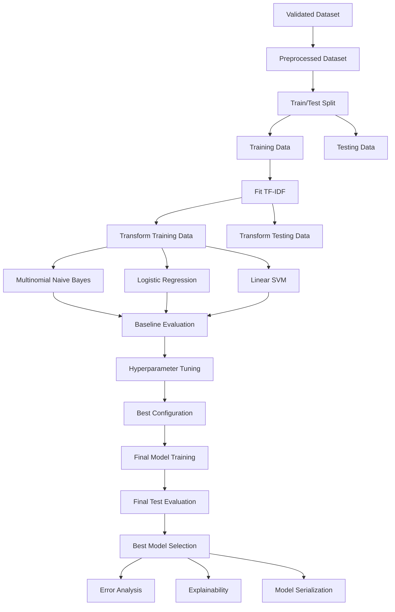

# Model Requirements Document (MRD)

## Performance Analysis of Machine Learning Algorithms for Cyberbullying Type Classification on Indonesian Text Using TF-IDF

---

## 1. Document Overview

This document defines the Machine Learning model requirements for the research project.

The project focuses on comparing classical Machine Learning algorithms for classifying cyberbullying types in Indonesian-language text.

The Machine Learning pipeline uses:

```text
Validated Dataset
      ↓
Text Preprocessing
      ↓
Train/Test Split
      ↓
TF-IDF Feature Extraction
      ↓
Baseline Model Training
      ↓
Hyperparameter Tuning
      ↓
Model Evaluation
      ↓
Best Model Selection
      ↓
Error Analysis
      ↓
Explainability
```

The primary objective is to determine which classical Machine Learning algorithm provides the best performance for Indonesian cyberbullying type classification using TF-IDF features.

---

# 2. Machine Learning Problem Definition

## 2.1 Problem Type

The project implements:

```text
Supervised Learning
        +
Multi-Class Classification
        +
Natural Language Processing
```

The model receives:

```text
Indonesian Text
```

and predicts:

```text
Cyberbullying Type
```

---

## 2.2 Input

The primary model input is:

```text
clean_text
```

Example:

```text
dasar bodoh tidak ada gunanya
```

The text is transformed into numerical features using TF-IDF.

---

## 2.3 Output

The model must predict one of the following classes:

```text
normal
insult
harassment
threat
hate_speech
```

Example:

```text
Input:
"Dasar bodoh, tidak ada gunanya."

Prediction:
insult
```

---

# 3. Target Classes

The Machine Learning model must support the following target classes:

```text
normal
insult
harassment
threat
hate_speech
```

The class names must remain consistent throughout:

- Dataset preparation.
- Training.
- Evaluation.
- Error analysis.
- Explainability.
- Streamlit inference.

---

# 4. Class Definitions

## 4.1 normal

Text that does not contain clear cyberbullying behavior.

Examples include:

- Neutral comments.
- Normal conversations.
- General statements.
- Non-abusive text.

---

## 4.2 insult

Text that directly attacks, humiliates, degrades, or insults an individual or group.

Examples may include:

- Direct name-calling.
- Derogatory expressions.
- Personal attacks.

---

## 4.3 harassment

Repeated, aggressive, abusive, or targeted behavior intended to disturb, intimidate, humiliate, or attack a target.

Harassment may involve broader repeated abusive behavior than a single insult.

---

## 4.4 threat

Text that expresses an intention or promise to cause harm.

The threat may involve:

- Physical harm.
- Violence.
- Serious intimidation.

---

## 4.5 hate_speech

Text that attacks, dehumanizes, or promotes hostility toward a protected group or identity.

The operational definition must remain consistent with the project labeling guidelines.

---

# 5. Feature Representation

The primary feature representation is:

```text
TF-IDF
```

The feature pipeline is:

```text
Clean Indonesian Text
      ↓
Train/Test Split
      ↓
Fit TF-IDF on Training Data Only
      ↓
Transform Training Data
      ↓
Transform Testing Data
```

The TF-IDF vectorizer must not be fitted on the entire dataset before splitting.

This is required to prevent data leakage.

---

# 6. TF-IDF Requirements

The TF-IDF vectorizer must:

- Convert text into numerical sparse features.
- Be fitted only on training data.
- Transform both training and testing data.
- Be saved for future inference.

The vectorizer must be saved as:

```text
models/tfidf_vectorizer.pkl
```

---

## 6.1 TF-IDF Configuration

The following parameters should be considered:

```text
ngram_range
min_df
max_df
sublinear_tf
max_features
```

Example:

```python
TfidfVectorizer(
    ngram_range=(1, 2),
    min_df=2,
    max_df=0.95,
    sublinear_tf=True
)
```

The final configuration must be documented and selected based on experimentation.

---

# 7. Dataset Split Requirements

The processed dataset must be split into:

```text
Training Set
Testing Set
```

Recommended split:

```text
80% Training
20% Testing
```

The split should use stratification:

```python
stratify=y
```

This is required to maintain a relatively consistent class distribution between the training and testing datasets.

A fixed random state must be used.

Recommended:

```python
RANDOM_STATE = 42
```

---

# 8. Primary Machine Learning Models

The project must compare the following algorithms:

1. Multinomial Naive Bayes.
2. Logistic Regression.
3. Linear Support Vector Machine.

All models must use:

- The same training dataset.
- The same testing dataset.
- The same TF-IDF representation.

This is required for a fair comparison.

---

# 9. Model 1: Multinomial Naive Bayes

## 9.1 Purpose

Multinomial Naive Bayes is used as a probabilistic baseline for text classification.

It is suitable for:

- Text classification.
- Sparse feature representations.
- TF-IDF-based features.

---

## 9.2 Main Hyperparameter

The primary hyperparameter is:

```text
alpha
```

The tuning process may explore values such as:

```text
0.01
0.1
0.5
1.0
```

The final search space may be adjusted based on the experiment.

---

# 10. Model 2: Logistic Regression

## 10.1 Purpose

Logistic Regression provides a strong baseline for multi-class text classification.

It is suitable for:

- High-dimensional TF-IDF features.
- Sparse matrices.
- Multi-class classification.

---

## 10.2 Main Hyperparameters

The tuning process may explore:

```text
C
class_weight
solver
max_iter
```

Example values:

```text
C:
0.01
0.1
1
10
100
```

The value of `max_iter` must be sufficiently high to allow model convergence.

---

# 11. Model 3: Linear Support Vector Machine

## 11.1 Purpose

Linear SVM is suitable for high-dimensional sparse text features.

It is included because linear models often perform strongly on TF-IDF-based text classification tasks.

---

## 11.2 Main Hyperparameters

The tuning process may explore:

```text
C
class_weight
```

Example:

```text
C:
0.01
0.1
1
10
100
```

---

# 12. Baseline Model Training

The baseline training stage must:

1. Load the prepared training features.
2. Load the testing features.
3. Train all three primary models.
4. Generate predictions.
5. Calculate initial performance metrics.
6. Store the results.

The baseline models must use consistent data.

---

## 12.1 Baseline Models

The baseline models are:

```text
Multinomial Naive Bayes
Logistic Regression
Linear SVM
```

---

## 12.2 Baseline Metrics

The following metrics must be recorded:

- Accuracy.
- Precision.
- Recall.
- F1-score.
- Macro F1-score.
- Weighted F1-score.

The results should be stored in:

```text
reports/training/baseline_results.csv
```

---

# 13. Hyperparameter Tuning

Hyperparameter tuning must be performed after baseline training.

The purpose is to identify better model configurations.

The tuning process should use cross-validation on the training data.

The test set must remain independent for final evaluation.

---

# 14. Cross-Validation Requirements

The correct workflow is:

```text
Training Data
      ↓
Cross-Validation
      ↓
Hyperparameter Search
      ↓
Best Configuration
      ↓
Final Model
      ↓
Final Test Evaluation
```

The test set must not be repeatedly used to select hyperparameters.

---

# 15. Hyperparameter Search

The search space must be explicitly defined.

Example:

```python
param_grid = {
    "C": [0.01, 0.1, 1, 10, 100]
}
```

The search strategy may use:

- Grid Search.
- Randomized Search.

The selected strategy must be documented.

---

# 16. Model Selection Metric

The primary model selection metric should be:

```text
Macro F1-score
```

Macro F1-score gives equal importance to each class.

This is important when the dataset contains class imbalance.

The following metrics must also be considered:

```text
Accuracy
Weighted F1-score
Precision
Recall
```

The final model selection must be based on overall evaluation results and per-class performance.

---

# 17. Model Evaluation Requirements

The final models must be evaluated using the independent test set.

Required metrics:

```text
Accuracy
Precision
Recall
F1-score
Macro F1-score
Weighted F1-score
```

The evaluation must generate:

```text
Classification Report
Confusion Matrix
Model Comparison Table
```

---

# 18. Multi-Class Evaluation

The project uses multi-class classification.

Therefore, evaluation must report performance for each individual class.

Example:

| Class       | Precision | Recall | F1-score |
| ----------- | --------: | -----: | -------: |
| normal      |         - |      - |        - |
| insult      |         - |      - |        - |
| harassment  |         - |      - |        - |
| threat      |         - |      - |        - |
| hate_speech |         - |      - |        - |

Overall accuracy alone must not be used as the only evaluation metric.

---

# 19. Confusion Matrix Requirements

A confusion matrix must be generated.

The matrix must compare:

```text
Actual Label
      vs
Predicted Label
```

The confusion matrix must be analyzed to identify frequently confused classes.

Examples of possible confusion patterns include:

```text
insult → harassment
harassment → insult
hate_speech → insult
normal → insult
```

The actual patterns must be determined from the evaluation results.

---

# 20. Model Comparison

The project must compare all trained models.

Example:

| Model                   | Accuracy | Macro F1 | Weighted F1 |
| ----------------------- | -------: | -------: | ----------: |
| Multinomial Naive Bayes |        - |        - |           - |
| Logistic Regression     |        - |        - |           - |
| Linear SVM              |        - |        - |           - |

The comparison must include:

```text
Baseline Models
```

and:

```text
Tuned Models
```

---

# 21. Best Model Selection

The best model should be selected based on:

1. Macro F1-score.
2. Overall classification performance.
3. Performance across individual classes.
4. Confusion matrix behavior.
5. Model stability.

The highest accuracy model is not automatically the best model.

A model with high accuracy but poor performance on minority classes may not be considered the best model.

---

# 22. Model Serialization

The final selected model must be saved.

Recommended location:

```text
models/best_model_tuned.pkl
```

The model must be loadable by the Streamlit application.

The model must not be retrained every time the Streamlit application starts.

---

# 23. Model Artifact Requirements

The following artifacts should be saved:

```text
models/
├── tfidf_vectorizer.pkl
└── best_model_tuned.pkl
```

Optional baseline models:

```text
models/
├── naive_bayes_baseline.pkl
├── logistic_regression_baseline.pkl
└── linear_svm_baseline.pkl
```

The exact naming convention must remain consistent.

---

# 24. Error Analysis Requirements

The best model must be used for error analysis.

The process must identify:

```text
Actual Label
      ≠
Predicted Label
```

The error analysis dataset should contain:

```text
original_text
clean_text
actual_label
predicted_label
```

Where technically supported, it may also include:

```text
confidence
```

---

# 25. Error Analysis Categories

The analysis should investigate:

- Insult predicted as harassment.
- Harassment predicted as insult.
- Threat predicted as another class.
- Hate speech confused with insult.
- Normal text incorrectly classified as cyberbullying.
- Cyberbullying text incorrectly classified as normal.

The exact confusion patterns must be determined from the evaluation results.

---

# 26. Explainability Requirements

The project must analyze important features from the best-performing model.

For linear models, explainability may use:

```text
Model Coefficients
      +
TF-IDF Feature Names
```

The analysis should identify:

```text
Top Features Per Class
```

Example:

```text
Class:
insult

Important Features:
term_1
term_2
term_3
```

---

# 27. Explainability Interpretation

Important features must be interpreted carefully.

A high feature weight means that a feature contributes strongly to a model decision.

It does not mean:

```text
One Word = One Certain Class
```

The interpretation must consider:

- Context.
- Multiple words.
- Feature combinations.
- Limitations of TF-IDF.

---

# 28. Model Reproducibility

The following must be recorded:

```text
Random State
Dataset Version
Train/Test Ratio
TF-IDF Configuration
Model Configuration
Hyperparameter Search Space
Cross-Validation Configuration
Evaluation Metrics
```

Recommended:

```python
RANDOM_STATE = 42
```

---

# 29. Data Leakage Prevention

The Machine Learning pipeline must follow:

```text
Validated Dataset
      ↓
Train/Test Split
      ↓
Fit TF-IDF on Training Data Only
      ↓
Transform Training Data
      ↓
Transform Testing Data
      ↓
Model Training
```

The following workflow is prohibited:

```text
Full Dataset
      ↓
Fit TF-IDF
      ↓
Train/Test Split
```

This can cause data leakage.

---

# 30. Model Training Pipeline



---

# 31. Notebook Mapping

The Machine Learning requirements are implemented through:

```text
06_tfidf.ipynb
      ↓
07_model_training.ipynb
      ↓
08_hyperparameter_tuning.ipynb
      ↓
09_model_evaluation.ipynb
      ↓
10_error_analysis.ipynb
      ↓
11_explainability.ipynb
```

Each notebook must have one clearly defined responsibility.

---

# 32. Model Training Notebook

The `07_model_training.ipynb` notebook must focus on:

- Loading TF-IDF features.
- Training baseline models.
- Generating predictions.
- Calculating baseline metrics.
- Comparing baseline models.

It must not perform extensive hyperparameter tuning.

---

# 33. Hyperparameter Tuning Notebook

The `08_hyperparameter_tuning.ipynb` notebook must focus on:

- Defining parameter spaces.
- Performing cross-validation.
- Searching for optimal configurations.
- Recording tuning results.
- Training the best model.

---

# 34. Model Evaluation Notebook

The `09_model_evaluation.ipynb` notebook must focus on:

- Evaluating final models.
- Generating classification reports.
- Generating confusion matrices.
- Comparing model performance.
- Selecting the best model.

---

# 35. Error Analysis Notebook

The `10_error_analysis.ipynb` notebook must focus on:

- Identifying misclassified samples.
- Analyzing confusion patterns.
- Investigating model weaknesses.
- Producing error analysis reports.

---

# 36. Explainability Notebook

The `11_explainability.ipynb` notebook must focus on:

- Extracting TF-IDF feature names.
- Analyzing model coefficients.
- Identifying important features.
- Generating feature importance reports.

---

# 37. Streamlit Inference Requirements

The Streamlit application must use:

```text
Saved Preprocessing Logic
      ↓
Saved TF-IDF Vectorizer
      ↓
Saved Best Model
```

The application must not train the model.

The inference pipeline is:

```text
User Input
      ↓
Text Preprocessing
      ↓
TF-IDF Transformation
      ↓
Best Model
      ↓
Predicted Label
```

---

# 38. Model Output Requirements

The application should display:

```text
Predicted Cyberbullying Type
```

Example:

```text
Prediction:
insult
```

Where technically supported, the application may also display:

```text
Class Probability
```

or:

```text
Prediction Confidence
```

The meaning of confidence must be clearly explained.

A confidence score must not automatically be interpreted as a guaranteed probability of correctness.

---

# 39. Final Model Requirements

The final model must:

- Be trained using the validated dataset.
- Use the defined preprocessing pipeline.
- Use TF-IDF features.
- Be evaluated using an independent test set.
- Be compared against alternative models.
- Be saved for inference.
- Be analyzed using error analysis.
- Be analyzed using explainability techniques.

---

# 40. Model Quality Criteria

The model evaluation must consider:

```text
Overall Performance
      +
Per-Class Performance
      +
Macro F1-Score
      +
Weighted F1-Score
      +
Confusion Matrix
      +
Error Analysis
```

The model must not be judged using accuracy alone.

---

# 41. Final Model Selection Criteria

The final model should be selected based on:

```text
Strong Macro F1-Score
      +
Balanced Per-Class Performance
      +
Acceptable Overall Performance
      +
Reasonable Confusion Matrix
      +
Stable Evaluation Results
```

The final selection must be documented in the research report.

---

# 42. Model Requirements Summary

The final Machine Learning system must:

- Perform multi-class classification.
- Use Indonesian text.
- Use TF-IDF features.
- Compare three classical Machine Learning algorithms.
- Perform baseline training.
- Perform hyperparameter tuning.
- Use cross-validation appropriately.
- Prevent data leakage.
- Evaluate using multiple metrics.
- Analyze per-class performance.
- Generate confusion matrices.
- Perform error analysis.
- Perform explainability analysis.
- Save the best model.
- Support Streamlit inference.

---

# 43. Final Machine Learning Principle

The model is only one part of the research pipeline.

The project must prioritize:

```text
Data Quality
      +
Correct Experimental Design
      +
Fair Model Comparison
      +
Reliable Evaluation
```

over simply achieving the highest possible accuracy.

The final research process must follow:

```text
Clean Data
      ↓
Correct Feature Engineering
      ↓
Fair Baseline Comparison
      ↓
Hyperparameter Tuning
      ↓
Independent Evaluation
      ↓
Error Analysis
      ↓
Explainability
      ↓
Final Model
```

The goal is not simply to produce a model that gives a high score.

The goal is to produce a model whose performance can be:

```text
Measured
      +
Compared
      +
Explained
      +
Reproduced
```

and whose limitations can be clearly understood.
