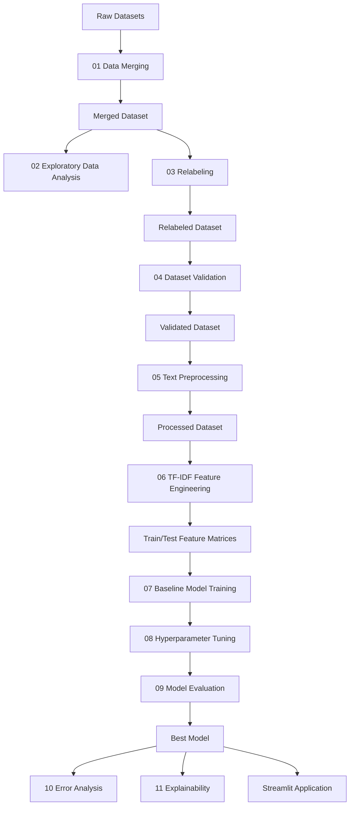

# Product Requirements Document (PRD)

# Performance Analysis of Machine Learning Algorithms for Cyberbullying Type Classification on Indonesian Text Using TF-IDF

---

## 1. Document Information

| Item                    | Description                                              |
| ----------------------- | -------------------------------------------------------- |
| Project Type            | Machine Learning Research Project                        |
| Domain                  | Natural Language Processing                              |
| Language                | Indonesian                                               |
| Problem Type            | Multi-Class Text Classification                          |
| Main Feature Extraction | TF-IDF                                                   |
| Primary Models          | Multinomial Naive Bayes, Logistic Regression, Linear SVM |
| Application Output      | Streamlit Proof-of-Concept                               |
| Architecture            | Notebook-Centered                                        |
| Project Status          | Research and Experimental                                |

---

# 2. Product Overview

This project is a Machine Learning research project that analyzes the performance of several classical Machine Learning algorithms for classifying types of cyberbullying in Indonesian-language text.

The project uses TF-IDF to transform Indonesian text into numerical features and compares the performance of several Machine Learning algorithms.

The primary objective is not to create a production-scale software system.

The primary objective is to:

> Conduct a clear, reproducible, and measurable Machine Learning experiment for Indonesian cyberbullying type classification.

The project emphasizes:

- Dataset quality.
- Transparent data processing.
- Reproducible experiments.
- Model comparison.
- Quantitative evaluation.
- Error analysis.
- Model explainability.

---

# 3. Problem Statement

Cyberbullying content in Indonesian-language text can take different forms.

Examples include:

- Insults.
- Harassment.
- Threats.
- Hate speech.

These categories may have overlapping linguistic characteristics.

For example, a sentence may contain insulting words while also being part of a harassment context.

This creates a challenge for automatic classification.

The research problem is:

> How effectively can Machine Learning algorithms classify different types of cyberbullying in Indonesian-language text using TF-IDF features?

A second research problem is:

> Which classical Machine Learning algorithm provides the best performance for classifying cyberbullying types in Indonesian text?

---

# 4. Product Vision

The project will produce a complete and reproducible Machine Learning research pipeline that transforms raw Indonesian text datasets into a trained classification model.

The complete process is:

```text
Raw Dataset
      ↓
Dataset Merging
      ↓
Exploratory Data Analysis
      ↓
Relabeling
      ↓
Dataset Validation
      ↓
Text Preprocessing
      ↓
TF-IDF Feature Extraction
      ↓
Baseline Model Training
      ↓
Hyperparameter Tuning
      ↓
Model Evaluation
      ↓
Error Analysis
      ↓
Explainability
      ↓
Streamlit Application
```

The final result is a Machine Learning model capable of predicting the type of cyberbullying in Indonesian text.

---

# 5. Research Objectives

The system must support the following objectives:

## 5.1 Dataset Preparation

The system must support the preparation of multiple raw datasets.

The system must:

- Load multiple datasets.
- Inspect their structures.
- Standardize relevant columns.
- Merge compatible datasets.
- Produce a unified dataset.

---

## 5.2 Dataset Quality Improvement

The system must support dataset quality analysis.

The system must identify:

- Missing text.
- Empty text.
- Missing labels.
- Invalid labels.
- Duplicate rows.
- Duplicate text.
- Duplicate text with conflicting labels.

The system must distinguish between:

```text
Duplicate with Same Label
```

and:

```text
Duplicate with Conflicting Labels
```

These must not be treated as the same issue.

---

## 5.3 Exploratory Data Analysis

The system must provide an overview of the dataset before Machine Learning training.

The analysis must include:

- Dataset size.
- Dataset structure.
- Missing values.
- Label distribution.
- Text length distribution.
- Duplicate analysis.
- Potential class imbalance.

The EDA stage must generate visual and numerical outputs.

---

## 5.4 Relabeling

The system must support manual review of potentially inconsistent labels.

The system must identify potential conflicts such as:

```text
Same Text
      ↓
Multiple Different Labels
```

Example:

```text
"dasar bodoh"

insult

harassment
```

These conflicts must be exported for review.

The final label must be determined through a manual review process.

The system must not automatically choose between conflicting labels without a defined manual decision.

---

## 5.5 Dataset Validation

The system must validate the relabeled dataset before Machine Learning processing.

Validation must include:

- Missing text detection.
- Empty text detection.
- Missing label detection.
- Invalid label detection.
- Duplicate detection.
- Label conflict detection.

The dataset must be considered ready for Machine Learning only after passing the required validation criteria.

---

# 6. Classification Labels

The system must support the following classification categories:

```text
normal
insult
harassment
threat
hate_speech
```

The labels must be consistent across:

- Dataset merging.
- Relabeling.
- Validation.
- Training.
- Evaluation.
- Streamlit prediction.

The label names must not be changed randomly between pipeline stages.

---

# 7. Text Preprocessing Requirements

The preprocessing stage must process Indonesian-language text.

The general preprocessing pipeline is:

```text
Original Text
      ↓
Lowercase
      ↓
Remove URLs
      ↓
Remove Mentions
      ↓
Remove Unnecessary Symbols
      ↓
Normalize Slang
      ↓
Handle Repeated Characters
      ↓
Tokenization
      ↓
Stopword Removal
      ↓
Stemming
      ↓
Clean Text
```

The original text must remain available.

The processed dataset should contain:

```text
text
clean_text
label
```

The preprocessing implementation must be reproducible.

The same preprocessing logic must be used during:

- Model training.
- Model inference in Streamlit.

---

# 8. Feature Engineering Requirements

TF-IDF must be used as the primary feature extraction method.

The feature engineering process must follow:

```text
Processed Dataset
      ↓
Train/Test Split
      ↓
Fit TF-IDF on Training Data Only
      ↓
Transform Training Data
      ↓
Transform Testing Data
```

The TF-IDF vectorizer must not be fitted using the complete dataset before splitting.

This is required to reduce the risk of data leakage.

The trained TF-IDF vectorizer must be saved and reused during inference.

---

# 9. Machine Learning Model Requirements

The project must compare multiple classical Machine Learning algorithms.

The primary algorithms are:

## 9.1 Multinomial Naive Bayes

The model is suitable for text classification and sparse feature representations.

---

## 9.2 Logistic Regression

The model provides a strong baseline for multi-class text classification.

It may also provide probability estimates useful for prediction confidence.

---

## 9.3 Linear Support Vector Machine

The model is suitable for high-dimensional sparse TF-IDF features.

It is commonly used for text classification tasks.

---

# 10. Baseline Training Requirements

The baseline training stage must:

1. Load the same training data.

2. Use the same TF-IDF representation.

3. Train all primary models.

4. Evaluate initial performance.

5. Store the results.

The baseline stage exists to establish a fair initial comparison.

The baseline results must be saved for comparison with tuned models.

---

# 11. Hyperparameter Tuning Requirements

The system must support hyperparameter tuning for the Machine Learning models.

The tuning process should:

- Use cross-validation where appropriate.
- Search multiple parameter configurations.
- Identify the best-performing configuration.
- Save the best model configuration.
- Compare tuning results.

The tuning process must not silently change:

- The dataset.
- The label definitions.
- The preprocessing strategy.

The final tuned model must be evaluated using the same evaluation strategy as the baseline models.

---

# 12. Model Evaluation Requirements

The project must evaluate classification performance using:

- Accuracy.
- Precision.
- Recall.
- F1-score.

For multi-class classification, the project must report:

- Macro F1-score.
- Weighted F1-score.

The project must also generate:

- Confusion matrix.
- Classification report.
- Model comparison table.

The final model selection must be based on the evaluation results.

The best-performing model must be clearly identified.

---

# 13. Error Analysis Requirements

The project must analyze incorrect predictions.

The error analysis must identify:

- Misclassified text.
- Actual labels.
- Predicted labels.
- Confusion patterns.
- Frequently confused classes.

The analysis should investigate possible causes such as:

- Similar vocabulary.
- Ambiguous language.
- Slang.
- Sarcasm.
- Short text.
- Context-dependent meaning.
- Overlapping cyberbullying characteristics.

The results must help explain model limitations.

---

# 14. Explainability Requirements

The project must provide an analysis of important features used by the best-performing model.

The explainability stage should identify:

- Important TF-IDF features.
- Important features per class.
- Feature weights where supported by the model.

The results should help explain which terms contribute to classification decisions.

The explainability results must not be interpreted as absolute proof that one word alone determines a classification.

---

# 15. Streamlit Application Requirements

The project must include a Streamlit proof-of-concept application.

The application must allow a user to enter Indonesian text.

The application must:

1. Receive text input.

2. Apply the same preprocessing strategy used during training.

3. Transform the text using the saved TF-IDF vectorizer.

4. Load the best-performing trained model.

5. Predict the cyberbullying category.

6. Display the predicted category.

7. Display confidence or probability information where technically supported.

The application must not train the model.

The application must only perform inference.

---

# 16. Functional Requirements

## FR-01: Dataset Merging

The system must be able to merge multiple compatible datasets into a unified dataset.

---

## FR-02: Dataset Analysis

The system must analyze the structure and distribution of the dataset.

---

## FR-03: Label Conflict Identification

The system must identify duplicate text with different labels.

---

## FR-04: Manual Label Review

The system must allow conflicting labels to be reviewed and corrected manually.

---

## FR-05: Dataset Validation

The system must validate the dataset before preprocessing.

---

## FR-06: Indonesian Text Preprocessing

The system must clean and normalize Indonesian text.

---

## FR-07: TF-IDF Feature Extraction

The system must transform text into numerical features using TF-IDF.

---

## FR-08: Multi-Model Training

The system must train multiple Machine Learning algorithms.

---

## FR-09: Model Comparison

The system must compare the performance of the trained algorithms.

---

## FR-10: Hyperparameter Optimization

The system must support hyperparameter tuning.

---

## FR-11: Final Model Evaluation

The system must evaluate the final models using classification metrics.

---

## FR-12: Error Analysis

The system must identify and analyze incorrect predictions.

---

## FR-13: Explainability

The system must identify important features associated with model predictions.

---

## FR-14: Prediction Application

The system must provide a Streamlit application for testing new text.

---

# 17. Non-Functional Requirements

## NFR-01: Reproducibility

The Machine Learning experiment must be reproducible.

The same dataset and configuration should produce comparable results.

---

## NFR-02: Debuggability

The project must be easy to debug.

Each notebook must have a clear responsibility.

The output of each stage must be visible and saved.

---

## NFR-03: Simplicity

The project must avoid unnecessary software architecture complexity.

The project should not use a complex `src/` architecture.

---

## NFR-04: Traceability

Each dataset transformation must produce a clear output.

The data flow must be traceable:

```text
Raw
  ↓
Merged
  ↓
Relabeled
  ↓
Validated
  ↓
Processed
```

---

## NFR-05: Consistency

The same:

- Label definitions.
- Preprocessing logic.
- TF-IDF vectorizer.

must be used consistently throughout the project.

---

## NFR-06: Data Integrity

Original datasets must not be silently overwritten.

Each major processing stage must produce a separate output.

---

# 18. Project Structure

The required project structure is:

```text
project/
│
├── data/
│   ├── raw/
│   ├── merged/
│   ├── relabeled/
│   ├── validated/
│   └── processed/
│
├── notebooks/
│   ├── 01_data_merging.ipynb
│   ├── 02_eda.ipynb
│   ├── 03_relabeling.ipynb
│   ├── 04_validation.ipynb
│   ├── 05_preprocessing.ipynb
│   ├── 06_tfidf.ipynb
│   ├── 07_model_training.ipynb
│   ├── 08_hyperparameter_tuning.ipynb
│   ├── 09_model_evaluation.ipynb
│   ├── 10_error_analysis.ipynb
│   └── 11_explainability.ipynb
│
├── models/
│
├── reports/
│
├── streamlit/
│   └── app.py
│
├── requirements.txt
│
└── README.md
```

---

# 19. Notebook Workflow Requirements

## Notebook 01: Data Merging

Input:

```text
data/raw/
```

Output:

```text
data/merged/merged_dataset.csv
```

---

## Notebook 02: EDA

Input:

```text
data/merged/merged_dataset.csv
```

Output:

```text
reports/eda/
```

The dataset must not be modified.

---

## Notebook 03: Relabeling

Input:

```text
data/merged/merged_dataset.csv
```

Output:

```text
data/relabeled/relabeled_dataset.csv
```

Additional review files may be generated under:

```text
reports/relabeling/
```

---

## Notebook 04: Validation

Input:

```text
data/relabeled/relabeled_dataset.csv
```

Output:

```text
data/validated/validated_dataset.csv
```

Additional reports may be generated under:

```text
reports/validation/
```

---

## Notebook 05: Preprocessing

Input:

```text
data/validated/validated_dataset.csv
```

Output:

```text
data/processed/preprocessed_dataset.csv
```

---

## Notebook 06: TF-IDF

Input:

```text
data/processed/preprocessed_dataset.csv
```

Output:

```text
models/tfidf_vectorizer.pkl
```

and:

```text
data/processed/
├── X_train.pkl
├── X_test.pkl
├── y_train.pkl
└── y_test.pkl
```

---

## Notebook 07: Model Training

Input:

```text
data/processed/
```

Output:

```text
models/
```

and:

```text
reports/training/
```

---

## Notebook 08: Hyperparameter Tuning

Input:

```text
Training Data
```

Output:

```text
models/best_model_tuned.pkl
```

and:

```text
reports/tuning/
```

---

## Notebook 09: Model Evaluation

Input:

```text
Trained Models
Test Data
```

Output:

```text
reports/evaluation/
```

---

## Notebook 10: Error Analysis

Input:

```text
Best Model
Test Data
Predictions
```

Output:

```text
reports/error_analysis/
```

---

## Notebook 11: Explainability

Input:

```text
Best Model
TF-IDF Vectorizer
```

Output:

```text
reports/explainability/
```

---

# 20. Complete Data Flow



---

# 21. Success Criteria

The project is considered successful when:

1. Multiple Indonesian cyberbullying datasets are successfully merged.

2. The dataset has been analyzed through EDA.

3. Label inconsistencies have been reviewed.

4. The dataset passes validation.

5. Indonesian text has been preprocessed.

6. TF-IDF features have been generated without data leakage.

7. Multiple Machine Learning models have been trained.

8. Baseline model performance has been recorded.

9. Hyperparameter tuning has been performed.

10. Final models have been evaluated.

11. Model performance has been compared using appropriate metrics.

12. Misclassified samples have been analyzed.

13. Important model features have been analyzed.

14. The best-performing model has been saved.

15. A Streamlit proof-of-concept application can classify new Indonesian text.

---

# 22. Research Output

The final research output should include:

## Dataset Outputs

```text
Merged Dataset
Relabeled Dataset
Validated Dataset
Processed Dataset
```

## Model Outputs

```text
TF-IDF Vectorizer
Baseline Models
Tuned Best Model
```

## Research Analysis Outputs

```text
EDA Results
Training Results
Hyperparameter Tuning Results
Evaluation Results
Error Analysis
Explainability Analysis
```

## Application Output

```text
Streamlit Cyberbullying Classification Application
```

---

# 23. Final Principle

The project is a research-oriented Machine Learning experiment.

The implementation must prioritize:

```text
Research Clarity
      >
Software Architecture Complexity
```

The system must remain:

- Simple.
- Transparent.
- Reproducible.
- Easy to debug.
- Easy to explain in an academic report.

The Machine Learning pipeline must follow:

```text
Merge
  ↓
EDA
  ↓
Relabel
  ↓
Validate
  ↓
Preprocess
  ↓
TF-IDF
  ↓
Train
  ↓
Tune
  ↓
Evaluate
  ↓
Analyze Errors
  ↓
Explain Model
  ↓
Deploy Proof-of-Concept
```
