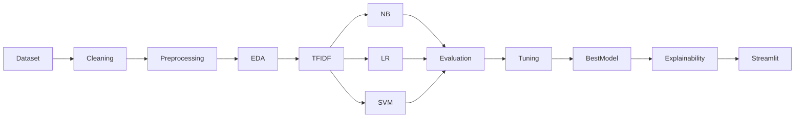

# Product Requirements Document (PRD)

# Project Information

| Item         | Description                                |
| ------------ | ------------------------------------------ |
| Project Name | Cyberbullying Text Classification          |
| Course       | Machine Learning                           |
| Project Type | Machine Learning Research & Implementation |
| Domain       | Natural Language Processing (NLP)          |
| Language     | Bahasa Indonesia                           |
| Deployment   | Streamlit                                  |

---

# Project Overview

Proyek ini bertujuan untuk membangun model Machine Learning yang mampu mengklasifikasikan jenis cyberbullying pada teks Bahasa Indonesia menggunakan representasi fitur TF-IDF. Penelitian berfokus pada analisis performa beberapa algoritma Machine Learning serta implementasi model terbaik ke dalam aplikasi berbasis Streamlit sebagai media demonstrasi.

---

# Problem Statement

Masih diperlukan pendekatan yang mampu mengklasifikasikan jenis cyberbullying secara otomatis pada teks Bahasa Indonesia. Selain menghasilkan prediksi, diperlukan evaluasi untuk mengetahui algoritma Machine Learning yang memiliki performa terbaik berdasarkan metrik klasifikasi.

---

# Objectives

## Primary Objective

Membangun model Machine Learning untuk mengklasifikasikan jenis cyberbullying pada teks Bahasa Indonesia.

---

## Secondary Objectives

- Membandingkan performa beberapa algoritma Machine Learning.
- Menentukan algoritma terbaik.
- Menampilkan hasil klasifikasi melalui Streamlit.
- Menampilkan interpretasi hasil prediksi menggunakan Explainable AI.

---

# Success Metrics

Project dianggap berhasil apabila:

- Dataset berhasil diproses.
- Model berhasil dilatih.
- Model dapat melakukan prediksi.
- Evaluasi model berhasil dilakukan.
- Streamlit dapat digunakan untuk melakukan inferensi.

---

# Target Users

## Primary User

Mahasiswa

---

## Secondary User

Dosen

---

# Functional Requirements

## FR-01 Dataset Management

Deskripsi

Sistem mampu membaca dataset dari file CSV.

Acceptance Criteria

- CSV berhasil dibaca.
- Dataset berhasil dimuat.
- Dataset tervalidasi.

Priority

High

---

## FR-02 Data Preprocessing

Deskripsi

Sistem melakukan preprocessing terhadap dataset.

Aktivitas

- Cleaning
- Lowercase
- Tokenizing
- Stopword Removal
- Stemming

Priority

High

---

## FR-03 Exploratory Data Analysis

Deskripsi

Sistem mampu menghasilkan visualisasi EDA.

Output

- Distribusi Label
- Missing Value
- Duplicate Data
- Word Frequency
- Text Length Distribution

Priority

High

---

## FR-04 Feature Extraction

Deskripsi

Mengubah teks menjadi representasi numerik menggunakan TF-IDF.

Priority

High

---

## FR-05 Model Training

Deskripsi

Sistem melatih beberapa algoritma Machine Learning.

Algoritma

- Naive Bayes
- Logistic Regression
- Support Vector Machine

Priority

High

---

## FR-06 Hyperparameter Tuning

Deskripsi

Melakukan optimasi parameter model menggunakan GridSearchCV atau RandomizedSearchCV.

Priority

Medium

---

## FR-07 Model Evaluation

Deskripsi

Melakukan evaluasi performa model.

Output

- Accuracy
- Precision
- Recall
- F1 Score
- ROC Curve
- Confusion Matrix

Priority

High

---

## FR-08 Explainable AI

Deskripsi

Menampilkan interpretasi hasil prediksi menggunakan SHAP atau LIME.

Output

- Kata yang paling berpengaruh
- Nilai kontribusi fitur

Priority

High

---

## FR-09 Streamlit Deployment

Deskripsi

Menyediakan antarmuka sederhana untuk melakukan prediksi.

Input

Teks

Output

- Prediksi kelas
- Confidence Score
- Probability Distribution
- Feature Importance

Priority

High

---

# Non Functional Requirements

## Performance

- Prediksi < 2 detik.

---

## Reliability

- Model dapat memproses seluruh input valid.

---

## Usability

- Antarmuka sederhana.
- Mudah digunakan.

---

## Maintainability

- Source code modular.
- Dokumentasi tersedia.

---

# Machine Learning Pipeline

---

# Streamlit Features

## Home

Informasi proyek.

---

## Dataset Summary

- Jumlah data
- Jumlah kelas
- Distribusi data

---

## Model Performance

- Accuracy
- Precision
- Recall
- F1 Score

---

## Prediction

Input teks.

Output

- Label
- Confidence
- Probability

---

## Explainability

Menampilkan SHAP/LIME.

---

# Deliverables

- Dataset
- Notebook
- Trained Model
- Streamlit
- Laporan
- Dokumentasi

---

# Out of Scope

Tidak termasuk:

- Deep Learning
- BERT
- LLM
- Mobile Application
- REST API
- User Authentication
- Database
- Monitoring Media Sosial
- Real-time Prediction
- Multi-language Classification
- Severity Classification
