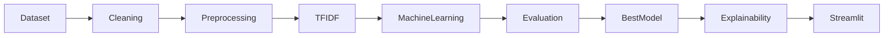

# Technical Requirements Document (TRD)

# Project Information

| Item       | Description                       |
| ---------- | --------------------------------- |
| Project    | Cyberbullying Text Classification |
| Type       | Machine Learning                  |
| Domain     | Natural Language Processing       |
| Deployment | Streamlit                         |
| Language   | Python                            |

---

# System Overview

Project dibangun menggunakan pendekatan Machine Learning berbasis Natural Language Processing (NLP) untuk melakukan klasifikasi jenis cyberbullying pada teks Bahasa Indonesia.

Model dibangun menggunakan representasi fitur TF-IDF dan dibandingkan menggunakan beberapa algoritma Machine Learning klasik. Model terbaik akan diimplementasikan pada aplikasi Streamlit sebagai media demonstrasi.

---

# High Level Architecture



---

# Technology Stack

## Programming Language

- Python 3.12+

---

## Machine Learning

- Scikit-Learn

---

## NLP

- NLTK
- Sastrawi

---

## Data Processing

- Pandas
- NumPy

---

## Visualization

- Matplotlib
- Seaborn

---

## Explainable AI

- SHAP

---

## Deployment

- Streamlit

---

## Model Serialization

- Joblib

---

# Project Structure

```text
project/

│

├── dataset/
│   ├── raw/
│   ├── cleaned/
│   └── processed/
│
├── notebook/
│   ├── 01_eda.ipynb
│   ├── 02_preprocessing.ipynb
│   ├── 03_training.ipynb
│   ├── 04_evaluation.ipynb
│   └── 05_explainability.ipynb
│
├── models/
│   ├── nb.pkl
│   ├── lr.pkl
│   ├── svm.pkl
│   ├── tfidf.pkl
│   └── best_model.pkl
│
├── src/
│   ├── preprocessing.py
│   ├── training.py
│   ├── evaluation.py
│   ├── prediction.py
│   ├── explainability.py
│   └── utils.py
│
├── streamlit/
│   ├── app.py
│   ├── pages/
│   └── assets/
│
├── reports/
│
├── docs/
│
├── requirements.txt
│
└── README.md
```

---

# Data Pipeline

```mermaid
flowchart TD

Dataset

↓

Validation

↓

Merge Dataset

↓

Cleaning

↓

Preprocessing

↓

Train Test Split

↓

TF-IDF

↓

Training

↓

Evaluation

↓

Model Selection

↓

Deployment
```

---

# Machine Learning Pipeline

```mermaid
flowchart LR

Training Data

-->

TF-IDF

-->

Naive Bayes

Training Data

-->

TF-IDF

-->

Logistic Regression

Training Data

-->

TF-IDF

-->

SVM

Naive Bayes

-->

Evaluation

Logistic Regression

-->

Evaluation

SVM

-->

Evaluation

Evaluation

-->

Best Model
```

---

# Text Preprocessing Pipeline

```mermaid
flowchart LR

Raw Text

-->

Lowercase

-->

Cleaning

-->

Tokenizing

-->

Stopword Removal

-->

Stemming

-->

Join Token
```

---

# Model Pipeline

## Feature Extraction

TF-IDF

---

## Algorithms

- Naive Bayes
- Logistic Regression
- Support Vector Machine

---

## Hyperparameter Optimization

GridSearchCV

atau

RandomizedSearchCV

---

## Validation Strategy

Train Test Split

80%

20%

Random State

42

Stratified Split

Enabled

---

# Evaluation Metrics

- Accuracy
- Precision
- Recall
- F1 Score
- ROC Curve
- Confusion Matrix

---

# Explainability

Model terbaik akan dianalisis menggunakan SHAP.

Output:

- Feature Importance
- Word Contribution
- Local Explanation

---

# Streamlit Architecture

```mermaid
flowchart LR

User

-->

Text Input

-->

Preprocessing

-->

TF-IDF

-->

Best Model

-->

Prediction

-->

SHAP

-->

Result
```

---

# Streamlit Features

## Home

Informasi project.

---

## Dataset

- Dataset Summary
- Label Distribution

---

## Model Evaluation

- Accuracy
- Precision
- Recall
- F1 Score
- ROC Curve

---

## Prediction

Input:

Text

Output:

- Prediction
- Confidence Score
- Probability
- Feature Importance

---

## Explainability

Visualisasi SHAP.

---

# Model Persistence

Model disimpan menggunakan Joblib.

File:

- best_model.pkl
- tfidf.pkl

---

# Performance Requirements

| Item            | Target       |
| --------------- | ------------ |
| Prediction Time | < 2 Seconds  |
| Memory Usage    | < 2 GB       |
| Startup Time    | < 10 Seconds |

---

# Dependencies

```
Python

pandas

numpy

scikit-learn

matplotlib

seaborn

streamlit

joblib

nltk

sastrawi

shap
```

---

# Deployment Workflow

```mermaid
flowchart TD

Notebook

↓

Training

↓

Save Model

↓

Joblib

↓

Streamlit

↓

Prediction

↓

Visualization
```

---

# Error Handling

## Dataset

- Missing File
- Invalid CSV
- Empty Dataset

---

## Prediction

- Empty Text
- Invalid Input
- Unknown Character

---

## Logging

Minimal logging:

- Dataset Loaded
- Training Started
- Training Finished
- Model Saved
- Prediction Success

---

# Security

- Tidak menggunakan autentikasi.
- Seluruh proses berjalan secara lokal.
- Tidak menyimpan data pengguna.

---

# Assumptions

- Dataset tersedia dalam format CSV.
- Model dapat dimuat menggunakan Joblib.
- Seluruh dependency telah terpasang.
- Aplikasi dijalankan pada lingkungan lokal.

---

# Deliverables

- Source Code
- Notebook
- Dataset
- Trained Model
- TF-IDF Vectorizer
- Streamlit Application
- Documentation

---

# Out of Scope

- Deep Learning
- Transformer
- BERT
- LLM
- REST API
- Database
- Docker
- Cloud Deployment
- Authentication
- Real-time Monitoring
- Mobile Application
