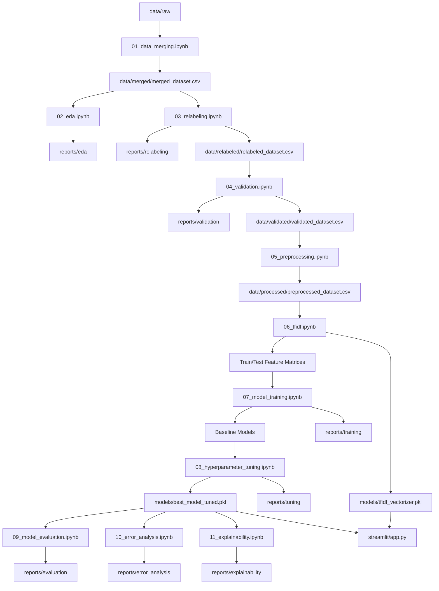

# Technical Requirements Document (TRD)

# Performance Analysis of Machine Learning Algorithms for Cyberbullying Type Classification on Indonesian Text Using TF-IDF

---

# 1. Document Overview

## 1.1 Purpose

This Technical Requirements Document defines the technical requirements, data flow, processing stages, Machine Learning methods, tools, technologies, project structure, and implementation rules for the Indonesian cyberbullying classification research project.

The project uses a notebook-centered Machine Learning workflow.

The primary objective is to create a clear, reproducible, transparent, and easy-to-debug Machine Learning pipeline.

The project is not designed as a production-grade Machine Learning platform.

The technical implementation must prioritize:

- Research reproducibility.
- Data traceability.
- Easy debugging.
- Clear experimentation.
- Simple implementation.
- Separation of research stages.

---

# 2. Technical Architecture

The project uses a notebook-centered architecture.

Each major research stage is implemented in a separate Jupyter Notebook.

The pipeline is sequential:

```text
Raw Dataset
      ↓
Data Merging
      ↓
Exploratory Data Analysis
      ↓
Relabeling
      ↓
Dataset Validation
      ↓
Text Preprocessing
      ↓
TF-IDF Feature Engineering
      ↓
Baseline Model Training
      ↓
Hyperparameter Tuning
      ↓
Model Evaluation
      ↓
Error Analysis
      ↓
Explainability
      ↓
Streamlit Application
```

Each notebook:

1. Reads the output of the previous stage.

2. Performs one primary research responsibility.

3. Displays the processing and analysis results.

4. Saves its output.

5. Must be independently understandable.

---

# 3. Project Architecture Principles

The project must follow these principles:

## 3.1 Notebook-Centered Development

The main Machine Learning logic must be implemented in Jupyter Notebooks.

The project must not use a complex `src/` architecture.

The project should not unnecessarily split simple Machine Learning logic into multiple Python modules.

---

## 3.2 Sequential Data Flow

Each stage must have a clear input and output.

Example:

```text
data/raw/
      ↓
01_data_merging.ipynb
      ↓
data/merged/
      ↓
02_eda.ipynb
```

Each stage must use the output from the previous stage.

---

## 3.3 Dataset Version Preservation

The original dataset must not be silently overwritten.

The project must preserve the dataset stages:

```text
Raw
  ↓
Merged
  ↓
Relabeled
  ↓
Validated
  ↓
Processed
```

Each stage must produce a separate output.

---

## 3.4 Reproducibility

The following must be reproducible:

- Dataset split.
- Preprocessing.
- TF-IDF feature extraction.
- Model training.
- Hyperparameter tuning.
- Model evaluation.

Random seeds must be set where appropriate.

Example:

```python
RANDOM_STATE = 42
```

---

# 4. Project Structure

The required project structure is:

```text
project/
│
├── data/
│   ├── raw/
│   ├── merged/
│   ├── relabeled/
│   ├── validated/
│   └── processed/
│
├── notebooks/
│   ├── 01_data_merging.ipynb
│   ├── 02_eda.ipynb
│   ├── 03_relabeling.ipynb
│   ├── 04_validation.ipynb
│   ├── 05_preprocessing.ipynb
│   ├── 06_tfidf.ipynb
│   ├── 07_model_training.ipynb
│   ├── 08_hyperparameter_tuning.ipynb
│   ├── 09_model_evaluation.ipynb
│   ├── 10_error_analysis.ipynb
│   └── 11_explainability.ipynb
│
├── models/
│
├── reports/
│
├── streamlit/
│   └── app.py
│
├── requirements.txt
│
└── README.md
```

---

# 5. Technology Stack

## 5.1 Programming Language

The primary programming language is:

```text
Python
```

Recommended version:

```text
Python 3.10+
```

The exact Python version should be documented in:

```text
README.md
```

---

## 5.2 Development Environment

The Machine Learning research process should use:

- Jupyter Notebook.
- JupyterLab.
- VS Code with Jupyter support.

The researcher may use any compatible notebook environment.

---

## 5.3 Data Processing Libraries

Recommended libraries:

```text
pandas
numpy
```

Responsibilities:

- Reading datasets.
- Data cleaning.
- Data transformation.
- Statistical analysis.
- Dataset manipulation.

---

## 5.4 Visualization Libraries

Recommended libraries:

```text
matplotlib
seaborn
```

Responsibilities:

- Label distribution.
- Text length distribution.
- Confusion matrix.
- Model comparison.
- Feature visualization.

---

## 5.5 Natural Language Processing Libraries

Recommended libraries may include:

```text
nltk
Sastrawi
regex
```

Responsibilities:

- Tokenization.
- Stopword removal.
- Indonesian stemming.
- Text normalization.

The exact library selection must be compatible with the project environment.

---

## 5.6 Machine Learning Libraries

The primary Machine Learning library is:

```text
scikit-learn
```

It must be used for:

- Train/test split.
- TF-IDF vectorization.
- Model training.
- Cross-validation.
- Hyperparameter tuning.
- Evaluation metrics.

---

## 5.7 Model Serialization

Recommended:

```text
joblib
```

The trained TF-IDF vectorizer and final model should be saved using a serialization method compatible with the Streamlit application.

---

## 5.8 Application Framework

The final proof-of-concept application uses:

```text
Streamlit
```

The application performs inference using the saved:

```text
TF-IDF Vectorizer
```

and:

```text
Best Trained Model
```

---

# 6. Dataset Technical Requirements

## 6.1 Required Columns

The final dataset must contain at least:

```text
text
label
```

The processed dataset may contain:

```text
text
clean_text
label
```

---

## 6.2 Text Requirements

The `text` column must contain Indonesian-language text.

The text may include:

- Social media comments.
- Informal language.
- Slang.
- Abbreviations.
- Repeated characters.
- URLs.
- Mentions.
- Emojis.
- Special characters.

The preprocessing pipeline must handle these characteristics appropriately.

---

## 6.3 Label Requirements

The classification labels must be standardized.

The expected labels are:

```text
normal
insult
harassment
threat
hate_speech
```

The labels must remain consistent throughout all stages.

---

# 7. Notebook 01: Data Merging

File:

```text
notebooks/01_data_merging.ipynb
```

## 7.1 Input

```text
data/raw/
```

The directory may contain multiple datasets.

Example:

```text
data/raw/
├── dataset_1.csv
├── dataset_2.csv
└── dataset_3.csv
```

---

## 7.2 Responsibilities

The notebook must:

1. Load raw datasets.

2. Inspect dataset columns.

3. Inspect dataset sizes.

4. Identify relevant text columns.

5. Identify relevant label columns.

6. Standardize column names.

7. Standardize label formats where appropriate.

8. Select required columns.

9. Merge compatible datasets.

10. Save the merged dataset.

---

## 7.3 Standard Output

```text
data/merged/merged_dataset.csv
```

Expected structure:

```text
text
label
```

---

## 7.4 Data Integrity

The notebook must not modify files in:

```text
data/raw/
```

The raw datasets must remain unchanged.

---

# 8. Notebook 02: Exploratory Data Analysis

File:

```text
notebooks/02_eda.ipynb
```

## 8.1 Input

```text
data/merged/merged_dataset.csv
```

---

## 8.2 Required Analysis

The notebook must analyze:

### Dataset Overview

- Number of rows.
- Number of columns.
- Data types.
- Dataset memory usage where useful.

### Missing Values

- Missing text.
- Empty text.
- Missing labels.

### Label Distribution

The notebook must calculate:

```text
Count per label
Percentage per label
```

### Text Length

The notebook should analyze:

- Character length.
- Word count.
- Minimum length.
- Maximum length.
- Average length.

### Duplicate Analysis

The notebook should identify:

- Exact duplicate rows.
- Duplicate text.
- Duplicate text with multiple labels.

---

## 8.3 Required Visualizations

Recommended visualizations:

- Label distribution bar chart.
- Text length histogram.
- Text length boxplot.
- Duplicate summary.

---

## 8.4 Output

Reports may be saved under:

```text
reports/eda/
```

Example:

```text
reports/eda/
├── eda_summary.csv
├── label_distribution.png
├── text_length_distribution.png
└── eda_report.md
```

The EDA notebook must not modify the merged dataset.

---

# 9. Notebook 03: Relabeling

File:

```text
notebooks/03_relabeling.ipynb
```

## 9.1 Input

```text
data/merged/merged_dataset.csv
```

---

## 9.2 Purpose

The purpose of this notebook is to identify and correct label inconsistencies.

The primary focus is:

```text
Same Text
      ↓
Multiple Different Labels
```

Example:

```text
Text:
"dasar bodoh"

Labels:
insult
harassment
```

---

## 9.3 Review Workflow

The notebook must:

1. Identify duplicate texts.

2. Group duplicate texts.

3. Identify multiple labels for the same text.

4. Export potential conflicts for manual review.

5. Allow manual review through a CSV file.

6. Apply the reviewed labels.

7. Save the relabeled dataset.

---

## 9.4 Review File

Example:

```text
reports/relabeling/label_conflicts.csv
```

Recommended columns:

```text
text
current_labels
final_label
review_status
review_notes
```

Example:

```csv
text,current_labels,final_label,review_status,review_notes
"dasar bodoh","insult|harassment","insult","RESOLVED","Direct insult"
```

---

## 9.5 Important Rule

The system must not automatically select a label when conflicting labels exist.

Conflicting labels must be manually reviewed.

---

## 9.6 Output

```text
data/relabeled/relabeled_dataset.csv
```

The original merged dataset must remain unchanged.

---

# 10. Notebook 04: Dataset Validation

File:

```text
notebooks/04_validation.ipynb
```

## 10.1 Input

```text
data/relabeled/relabeled_dataset.csv
```

---

## 10.2 Validation Checks

The notebook must check:

### Text Validation

- Missing text.
- Empty text.
- Whitespace-only text.

### Label Validation

- Missing labels.
- Invalid labels.
- Unexpected label values.

### Duplicate Validation

The notebook must distinguish:

#### Exact Duplicate

Same:

```text
text
label
```

#### Same-Label Duplicate

Same text appears multiple times with the same label.

#### Label Conflict

Same text appears with multiple different labels.

---

## 10.3 Validation Summary

The notebook should generate a summary containing:

```text
Total Rows
Unique Texts
Missing Text Count
Empty Text Count
Missing Label Count
Invalid Label Count
Exact Duplicate Count
Same-Label Duplicate Count
Label Conflict Count
```

---

## 10.4 Dataset Readiness

The dataset should be considered ready when:

- No critical missing text exists.
- No critical missing labels exist.
- No invalid labels remain.
- Label conflicts have been reviewed.
- The dataset is structurally valid.

---

## 10.5 Output

```text
data/validated/validated_dataset.csv
```

Validation reports may be stored in:

```text
reports/validation/
```

Example:

```text
reports/validation/
├── validation_summary.csv
├── duplicate_same_label.csv
└── duplicate_label_conflicts.csv
```

---

# 11. Notebook 05: Text Preprocessing

File:

```text
notebooks/05_preprocessing.ipynb
```

## 11.1 Input

```text
data/validated/validated_dataset.csv
```

---

## 11.2 Preprocessing Pipeline

The general pipeline is:

```text
Original Text
      ↓
Lowercase
      ↓
Remove URLs
      ↓
Remove Mentions
      ↓
Normalize Repeated Characters
      ↓
Normalize Slang
      ↓
Remove Unnecessary Symbols
      ↓
Tokenization
      ↓
Stopword Removal
      ↓
Indonesian Stemming
      ↓
Clean Text
```

---

## 11.3 Original Text Preservation

The original text must not be removed.

Expected output:

```text
text
clean_text
label
```

Example:

```text
text:
"Dasar GOBLOKKK banget!!!"

clean_text:
"dasar goblok banget"
```

---

## 11.4 Preprocessing Consistency

The same preprocessing logic must be used:

- During training.
- During Streamlit inference.

Differences between training preprocessing and inference preprocessing should be avoided.

---

## 11.5 Output

```text
data/processed/preprocessed_dataset.csv
```

---

# 12. Notebook 06: TF-IDF Feature Engineering

File:

```text
notebooks/06_tfidf.ipynb
```

## 12.1 Input

```text
data/processed/preprocessed_dataset.csv
```

---

## 12.2 Required Processing Order

The correct order is:

```text
Processed Dataset
      ↓
Train/Test Split
      ↓
Fit TF-IDF on Training Text
      ↓
Transform Training Text
      ↓
Transform Testing Text
```

---

## 12.3 Data Leakage Prevention

The TF-IDF vectorizer must not be fitted on the entire dataset before splitting.

Incorrect:

```text
Entire Dataset
      ↓
Fit TF-IDF
      ↓
Train/Test Split
```

Correct:

```text
Dataset
      ↓
Train/Test Split
      ↓
Fit TF-IDF on Training Data
      ↓
Transform Test Data
```

---

## 12.4 Recommended Configuration

The TF-IDF configuration should be documented and reproducible.

Possible parameters:

```text
ngram_range
min_df
max_df
sublinear_tf
max_features
```

The final configuration must be documented in the notebook.

---

## 12.5 Output

The notebook should save:

```text
models/tfidf_vectorizer.pkl
```

Training and testing matrices:

```text
data/processed/
├── X_train.pkl
├── X_test.pkl
├── y_train.pkl
└── y_test.pkl
```

---

# 13. Notebook 07: Baseline Model Training

File:

```text
notebooks/07_model_training.ipynb
```

## 13.1 Input

```text
data/processed/X_train.pkl
data/processed/X_test.pkl
data/processed/y_train.pkl
data/processed/y_test.pkl
```

---

## 13.2 Models

The notebook must train:

```text
Multinomial Naive Bayes
Logistic Regression
Linear SVM
```

---

## 13.3 Training Requirements

All models must:

- Use the same training data.
- Use the same test data.
- Use the same TF-IDF representation.
- Use the same evaluation strategy.

This is required for a fair comparison.

---

## 13.4 Baseline Metrics

The notebook should calculate:

- Accuracy.
- Precision.
- Recall.
- F1-score.

For multi-class classification:

- Macro F1.
- Weighted F1.

---

## 13.5 Output

Baseline model files may be saved under:

```text
models/
```

Example:

```text
models/
├── naive_bayes_baseline.pkl
├── logistic_regression_baseline.pkl
└── linear_svm_baseline.pkl
```

Results:

```text
reports/training/baseline_results.csv
```

---

# 14. Notebook 08: Hyperparameter Tuning

File:

```text
notebooks/08_hyperparameter_tuning.ipynb
```

## 14.1 Purpose

The purpose is to identify improved model configurations.

---

## 14.2 Tuning Method

The notebook may use:

```text
GridSearchCV
```

or:

```text
RandomizedSearchCV
```

The selected method must be documented.

---

## 14.3 Cross-Validation

Cross-validation should be used where appropriate.

The cross-validation strategy must be consistent with the classification task.

Stratification should be used where appropriate to preserve label distributions.

---

## 14.4 Candidate Parameters

Potential parameters include:

### Logistic Regression

```text
C
solver
class_weight
```

### Linear SVM

```text
C
class_weight
```

### Multinomial Naive Bayes

```text
alpha
```

The actual search space must be documented in the notebook.

---

## 14.5 Output

The best model should be saved under:

```text
models/best_model_tuned.pkl
```

Tuning results:

```text
reports/tuning/tuning_results.csv
```

Best parameters:

```text
reports/tuning/best_parameters.json
```

---

# 15. Notebook 09: Model Evaluation

File:

```text
notebooks/09_model_evaluation.ipynb
```

## 15.1 Purpose

This notebook performs the final comparison of trained models.

---

## 15.2 Required Metrics

The notebook must calculate:

```text
Accuracy
Precision
Recall
F1-Score
```

For multi-class evaluation:

```text
Macro F1
Weighted F1
```

---

## 15.3 Confusion Matrix

A confusion matrix must be generated.

The confusion matrix must show:

```text
Actual Labels
vs
Predicted Labels
```

---

## 15.4 Classification Report

The notebook should generate per-class metrics:

```text
Precision
Recall
F1-Score
Support
```

---

## 15.5 Model Selection

The best model must be selected based on the evaluation results.

The selection criteria must be documented.

The model must not be selected based on accuracy alone if the dataset is imbalanced.

---

## 15.6 Output

```text
reports/evaluation/
├── model_comparison.csv
├── classification_report.csv
└── confusion_matrix.png
```

---

# 16. Notebook 10: Error Analysis

File:

```text
notebooks/10_error_analysis.ipynb
```

## 16.1 Purpose

The purpose is to analyze incorrect predictions made by the best model.

---

## 16.2 Required Data

The analysis should include:

```text
Original Text
Clean Text
Actual Label
Predicted Label
```

Where available:

```text
Prediction Confidence
```

---

## 16.3 Analysis Areas

The notebook should investigate:

- Most frequently confused classes.
- Ambiguous text.
- Similar vocabulary.
- Slang.
- Sarcasm.
- Short text.
- Context-dependent language.
- Overlapping cyberbullying categories.

---

## 16.4 Output

```text
reports/error_analysis/
```

Example:

```text
reports/error_analysis/
├── misclassified_samples.csv
├── confusion_patterns.csv
└── error_analysis_report.md
```

---

# 17. Notebook 11: Explainability

File:

```text
notebooks/11_explainability.ipynb
```

## 17.1 Purpose

The purpose is to analyze which TF-IDF features contribute to model predictions.

---

## 17.2 Explainability Method

For linear models, the analysis may use:

```text
Model Coefficients
```

combined with:

```text
TF-IDF Feature Names
```

The notebook should identify:

```text
Top Features per Class
```

---

## 17.3 Output

```text
reports/explainability/
```

Example:

```text
reports/explainability/
├── top_features_by_class.csv
└── feature_importance.png
```

---

# 18. Model Serialization

The trained vectorizer and best model must be saved for later inference.

Recommended format:

```text
.pkl
```

Recommended serialization library:

```text
joblib
```

Required artifacts:

```text
models/
├── tfidf_vectorizer.pkl
└── best_model_tuned.pkl
```

The saved artifacts must be compatible with:

```text
streamlit/app.py
```

---

# 19. Streamlit Technical Requirements

File:

```text
streamlit/app.py
```

## 19.1 Application Responsibilities

The application must:

1. Load the saved TF-IDF vectorizer.

2. Load the saved Machine Learning model.

3. Receive Indonesian text input.

4. Apply the same preprocessing logic used during training.

5. Transform the input using the saved TF-IDF vectorizer.

6. Generate a prediction.

7. Display the predicted cyberbullying category.

8. Display confidence information where supported.

---

## 19.2 Application Flow

```text
User Input
      ↓
Text Preprocessing
      ↓
TF-IDF Transform
      ↓
Best Model
      ↓
Prediction
      ↓
Result Display
```

---

## 19.3 Training Restriction

The Streamlit application must not:

- Retrain the model.
- Fit a new TF-IDF vectorizer.
- Modify the training dataset.
- Perform hyperparameter tuning.

The application is only for inference.

---

# 20. Data Leakage Prevention

The following rules must be followed.

## Rule 1

Do not fit TF-IDF on the entire dataset before splitting.

---

## Rule 2

Do not use test data for model training.

---

## Rule 3

Do not use test labels during training.

---

## Rule 4

Do not tune hyperparameters using the final test set.

---

## Rule 5

The final test set must remain independent for final evaluation.

---

# 21. Reproducibility Requirements

The project should define:

```python
RANDOM_STATE = 42
```

where appropriate.

The following should be reproducible:

- Train/test split.
- Cross-validation.
- Model training where supported.
- Hyperparameter tuning where supported.

The project environment should be documented.

---

# 22. Requirements File

The `requirements.txt` file should contain the libraries required to run the project.

Potential dependencies:

```text
pandas
numpy
scikit-learn
matplotlib
seaborn
jupyter
jupyterlab
nltk
Sastrawi
joblib
streamlit
```

The exact versions should be recorded where necessary for reproducibility.

Example:

```text
pandas==X.X.X
numpy==X.X.X
scikit-learn==X.X.X
```

The actual versions must match the working project environment.

---

# 23. Report Organization

The reports directory should be organized by research stage:

```text
reports/
│
├── eda/
│
├── relabeling/
│
├── validation/
│
├── training/
│
├── tuning/
│
├── evaluation/
│
├── error_analysis/
│
└── explainability/
```

Each report must clearly indicate:

- The source dataset.
- The processing stage.
- The relevant parameters.
- The result.

---

# 24. Technical Data Flow



---

# 25. Technical Quality Requirements

The implementation must satisfy the following:

## TQR-01: Clear Input and Output

Every notebook must clearly identify:

```text
Input
Processing
Output
```

---

## TQR-02: No Hidden Processing

Important Machine Learning logic must be visible in the notebook.

The project should not hide essential logic inside unknown external modules.

---

## TQR-03: No Unnecessary Abstraction

The project must not create unnecessary:

- Classes.
- Services.
- Managers.
- Factories.
- Utility layers.

Simple research logic should remain directly visible in the notebook.

---

## TQR-04: Reusable Model Artifacts

The final vectorizer and model must be saved and reusable.

---

## TQR-05: Consistent Preprocessing

Training and inference preprocessing must be consistent.

---

## TQR-06: Dataset Traceability

The origin and transformation of the dataset must be traceable.

---

# 26. Error Handling Requirements

The notebooks should provide clear errors for:

- Missing input files.
- Missing required columns.
- Invalid label values.
- Empty datasets.
- Missing model files.
- Missing TF-IDF vectorizer.
- Incompatible data formats.

Errors should provide useful explanations.

Example:

```text
FileNotFoundError:
Expected dataset not found:
data/merged/merged_dataset.csv

Please run 01_data_merging.ipynb first.
```

---

# 27. Final Technical Pipeline

The final technical pipeline is:

```text
01_data_merging.ipynb
        ↓
data/merged/merged_dataset.csv
        ↓
02_eda.ipynb
        ↓
03_relabeling.ipynb
        ↓
data/relabeled/relabeled_dataset.csv
        ↓
04_validation.ipynb
        ↓
data/validated/validated_dataset.csv
        ↓
05_preprocessing.ipynb
        ↓
data/processed/preprocessed_dataset.csv
        ↓
06_tfidf.ipynb
        ↓
Train/Test Feature Matrices
        ↓
07_model_training.ipynb
        ↓
Baseline Models
        ↓
08_hyperparameter_tuning.ipynb
        ↓
Best Tuned Model
        ↓
09_model_evaluation.ipynb
        ↓
Final Model Selection
        ↓
10_error_analysis.ipynb
        ↓
11_explainability.ipynb
        ↓
streamlit/app.py
```

---

# 28. Final Technical Principle

This project must remain a research-oriented Machine Learning project.

The implementation must prioritize:

```text
Clarity
      >
Complexity
```

and:

```text
Reproducibility
      >
Unnecessary Abstraction
```

The project must be understandable by a researcher who needs to:

- Inspect the dataset.
- Understand each transformation.
- Debug errors.
- Reproduce experiments.
- Explain the methodology in an academic report.

The project must not become unnecessarily complex.

The primary technical goal is:

> Build a clear, reproducible, and academically defensible Machine Learning pipeline for Indonesian cyberbullying type classification using TF-IDF and classical Machine Learning algorithms.
